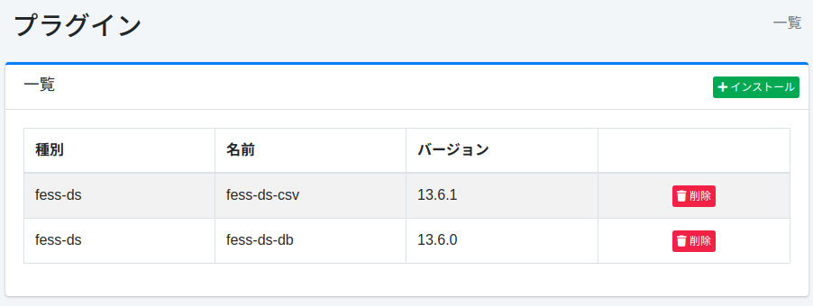

=========
Plugins
=========

Présentation
============

La page de configuration des plugins gère les plugins.

Gestion
=======

Affichage
---------

Pour ouvrir la page de liste des plugins installés illustrée ci-dessous, cliquez sur [Système > Plugins] dans le menu de gauche.

|image0|

Pour désinstaller, cliquez sur le bouton Supprimer.

Installation
------------

Pour installer un nouveau plugin, cliquez sur le bouton Installer.

|image1|

Sélectionnez le plugin que vous souhaitez installer dans le menu déroulant et cliquez sur le bouton Installer pour démarrer l'installation.

.. |image1| image:: ../../../resources/images/ja/15.3/admin/plugin-2.png
