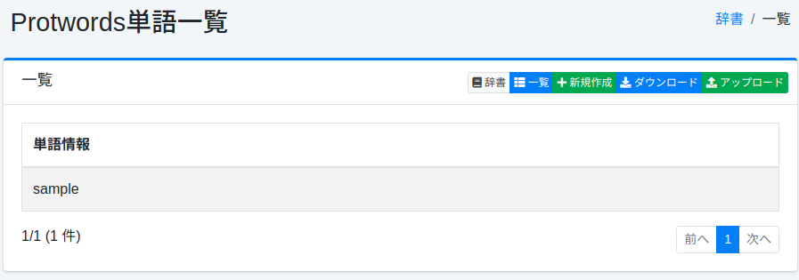
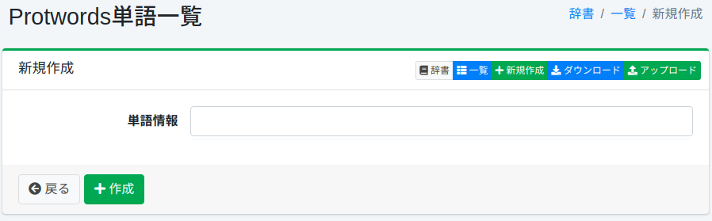

=======================
Dictionnaire Protwords
=======================

Présentation
============

Vous pouvez gérer les mots à exclure du traitement de stemming.
Le traitement de stemming étant essentiellement basé sur des règles, une normalisation non intentionnelle peut se produire.
Par exemple, le mot Maine (nom d'un état américain) serait normalisé en main.

Gestion
=======

Affichage
---------

Pour ouvrir la page de liste de configuration Protwords illustrée ci-dessous, sélectionnez [Système > Dictionnaire] dans le menu de gauche, puis cliquez sur protwords.

|image0|

Cliquez sur le nom de la configuration pour la modifier.

Méthode de configuration
-------------------------

Cliquez sur le bouton Nouvelle création pour ouvrir la page de configuration Protwords.

|image1|

Paramètres de configuration
----------------------------

Informations sur les mots
::::::::::::::::::::::::::

Entrez les mots à exclure du traitement de stemming.

Téléchargement
==============

Vous pouvez télécharger au format de dictionnaire Protwords.

Téléversement
=============

Vous pouvez téléverser au format de dictionnaire Protwords.

