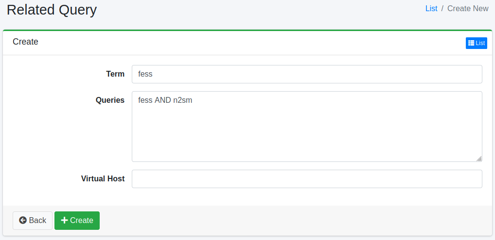

==================
Requête associée
==================

Présentation
============

Cette section explique la configuration des requêtes associées.
Vous pouvez améliorer les résultats de recherche avec les requêtes associées enregistrées.
Les requêtes associées peuvent être utilisées comme mots alternatifs pour les termes de recherche.

Gestion
=======

Affichage
---------

Pour ouvrir la page de liste pour configurer les requêtes associées illustrée ci-dessous, cliquez sur [Crawler > Requête associée] dans le menu de gauche.

|image0|

Cliquez sur le nom de la configuration pour la modifier.

Création de configuration
--------------------------

Cliquez sur le bouton Nouvelle création pour ouvrir la page de configuration des requêtes associées.

|image1|

Paramètres de configuration
----------------------------

Terme de recherche
::::::::::::::::::

Spécifie le terme de recherche à faire correspondre avec la requête de recherche.

Requête
:::::::

Spécifie la requête.

Hôte virtuel
::::::::::::

Spécifie le nom d'hôte de l'hôte virtuel.
Pour plus de détails, consultez :doc:`Configuration de l'hôte virtuel dans le guide de configuration <../config/virtual-host>`.

Suppression de configuration
-----------------------------

Cliquez sur le nom de la configuration dans la page de liste, puis cliquez sur le bouton Supprimer pour afficher l'écran de confirmation.
Appuyer sur le bouton Supprimer supprimera la configuration.

.. |image0| image:: ../../../resources/images/en/15.3/admin/relatedquery-1.png

