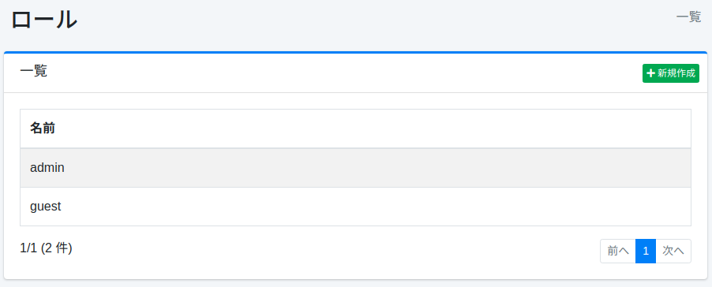
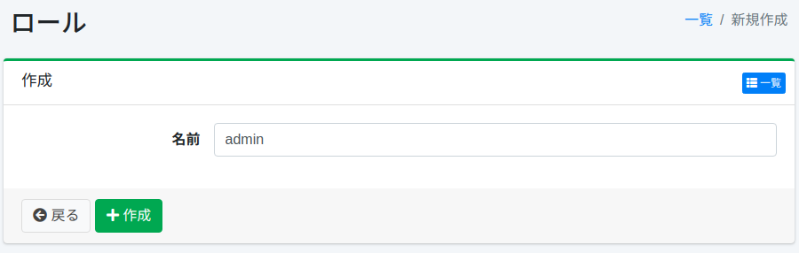

======
Rôle
======

Présentation
============

Vous pouvez gérer les rôles auxquels les utilisateurs appartiennent.
Cela peut être utilisé pour l'intégration LDAP, par exemple.

Gestion
=======

Affichage
---------

Pour ouvrir la page de liste de configuration des rôles illustrée ci-dessous, cliquez sur [Utilisateur > Rôle] dans le menu de gauche.

|image0|

Cliquez sur le nom de la configuration pour la modifier.

Création de configuration
--------------------------

Cliquez sur le bouton Nouvelle création pour ouvrir la page de configuration des rôles.

|image1|

Paramètres de configuration
----------------------------

Nom
::::

Nom du rôle.

Suppression de configuration
-----------------------------

Cliquez sur le nom de la configuration dans la page de liste, puis cliquez sur le bouton Supprimer pour afficher l'écran de confirmation.
Appuyer sur le bouton Supprimer supprimera la configuration.

