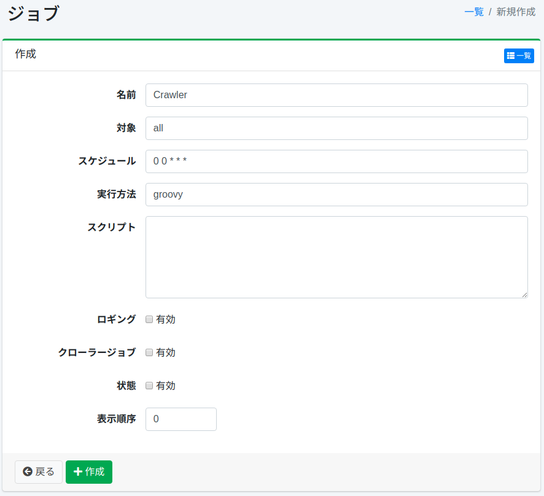

=======================
Planificateur de tâches
=======================

Présentation
============

Cette section explique les paramètres de configuration du planificateur de tâches.

Gestion
=======

Affichage
---------

Pour ouvrir la page de liste de configuration du planificateur de tâches illustrée ci-dessous, cliquez sur [Système > Planificateur] dans le menu de gauche.

|image0|

Cliquez sur le nom de la configuration pour la modifier.

Création de configuration
--------------------------

Cliquez sur le bouton Nouvelle création pour ouvrir la page de configuration du planificateur.

|image1|

Paramètres de configuration
----------------------------

Nom
::::

Nom affiché dans la liste.

Cible
:::::

La cible peut être utilisée comme identifiant pour déterminer si la tâche doit être exécutée lors de l'exécution directe de commandes par lots, etc.
Si vous n'exécutez pas de crawl par commande, spécifiez « all ».

Planification
:::::::::::::

Configure la planification.
La tâche décrite dans le script sera exécutée selon la planification configurée ici.

Le format de description est le format CRON et s'écrit sous la forme « minute heure jour mois jour_de_la_semaine ».
Par exemple, « 0 12 \* \* 3 » exécutera la tâche tous les mercredis à 12:00 pm.

Méthode d'exécution
:::::::::::::::::::

Spécifie l'environnement d'exécution du script.
Actuellement, seul « groovy » est pris en charge.

Script
::::::

Décrit le contenu d'exécution de la tâche dans le langage spécifié dans la méthode d'exécution.

Par exemple, si vous souhaitez exécuter uniquement trois configurations de crawl comme tâche de crawl, décrivez comme suit (en supposant que les ID des configurations de crawl Web sont 1 et 2 et que l'ID de la configuration de crawl du système de fichiers est 1).

::

    return container.getComponent("crawlJob").logLevel("info").webConfigIds(["1", "2"] as String[]).fileConfigIds(["1"] as String[]).dataConfigIds([] as String[]).execute(executor);

Journalisation
::::::::::::::

L'activation enregistre dans le journal des tâches.

Tâche de crawl
::::::::::::::

L'activation traite comme une tâche de crawl.
En configurant job.max.crawler.processes dans fess_config.properties, vous pouvez empêcher le démarrage excessif du crawler.
Par défaut, il n'y a aucune limite au nombre de démarrages du crawler.

État
::::

Spécifie l'état actif/inactif de la tâche.
Si désactivé, la tâche ne sera pas exécutée.

Ordre d'affichage
:::::::::::::::::

Spécifie l'ordre d'affichage dans la liste des tâches.

Suppression de configuration
-----------------------------

Cliquez sur le nom de la configuration dans la page de liste, puis cliquez sur le bouton Supprimer pour afficher l'écran de confirmation.
Appuyer sur le bouton Supprimer supprimera la configuration.

Méthode de crawl manuel
=======================

Cliquez sur « Default Crawler » dans « Planificateur », puis cliquez sur le bouton « Démarrer maintenant ».
Pour arrêter le crawler, cliquez sur « Default Crawler », puis cliquez sur le bouton « Arrêter ».

.. |image0| image:: ../../../resources/images/ja/15.3/admin/scheduler-1.png

