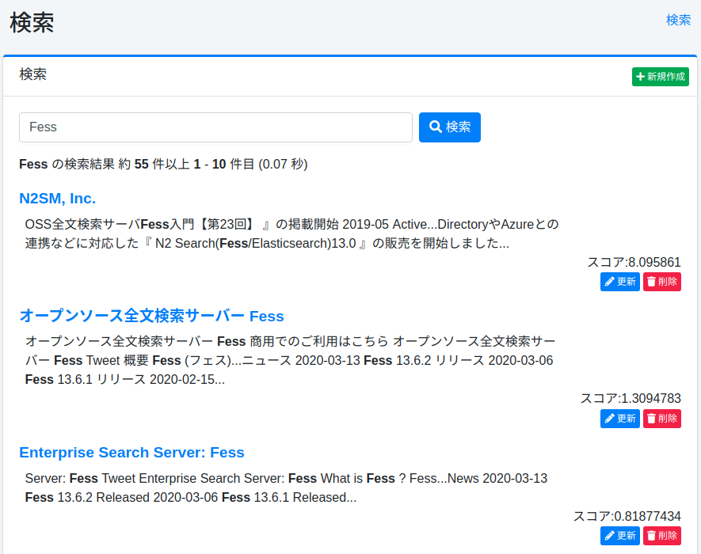

=========
Recherche
=========

Présentation
============

Cette section explique la recherche d'administration.

Gestion
=======

Affichage
---------

Pour ouvrir la page de recherche illustrée ci-dessous, cliquez sur [Informations système > Recherche] dans le menu de gauche.

|image0|

Liste de recherche
------------------

Vous pouvez effectuer une recherche avec les conditions spécifiées.
Dans l'écran de recherche normal, les conditions de rôle et de navigateur sont ajoutées implicitement, mais elles ne le sont pas dans cette recherche d'administration.
Vous pouvez également supprimer des documents spécifiques de l'index à partir des résultats de recherche affichés.

Suppression en masse
--------------------

Si vous souhaitez supprimer tous les documents de l'index, cliquez sur le bouton « Tout supprimer avec cette requête » avec « \*:\* » pour les supprimer.
Il est également possible de supprimer uniquement les documents cibles en spécifiant les conditions de recherche.

