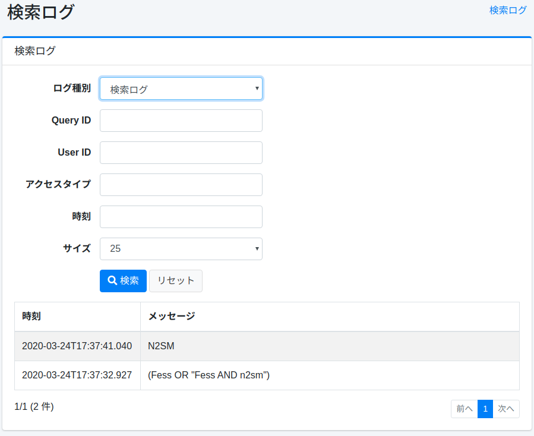
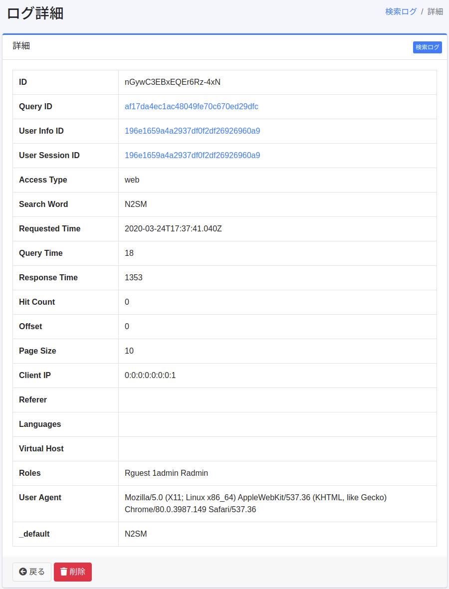

==================
Journal de recherche
==================

Présentation
============

Les résultats d'exécution des recherches, clics et favoris sont enregistrés, et les journaux de recherche peuvent être vérifiés dans cet écran d'administration.

Gestion
=======

Liste
=====

Dans la liste, vous pouvez vérifier les journaux de recherche, de clics et de favoris.
Si vous souhaitez vérifier les détails d'un journal de recherche, cliquez sur le journal de recherche cible.

|image0|

Détails
=======

En cliquant sur un journal de recherche dans la liste, les détails du journal de recherche cible s'affichent.

|image1|

