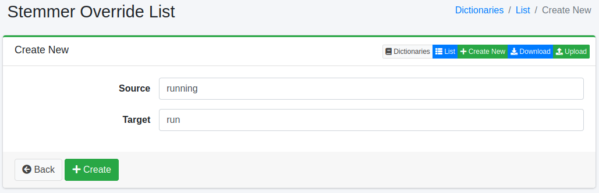

===================================
Dictionnaire de remplacement Stemmer
====================================

Présentation
============

Vous pouvez remplacer le stemming de caractères spécifiques (symboles, codes de caractères, pleine/demi-largeur) par d'autres caractères.

Gestion
=======

Affichage
---------

Pour ouvrir la page de liste de configuration de remplacement Stemmer illustrée ci-dessous, sélectionnez [Système > Dictionnaire] dans le menu de gauche, puis cliquez sur stemmeroverride.

|image0|

Cliquez sur le nom de la configuration pour la modifier.

Méthode de configuration
------------------------

Cliquez sur le bouton Nouvelle création pour ouvrir la page de configuration de remplacement Stemmer.

|image1|

Paramètres de configuration
---------------------------

Source de conversion
:::::::::::::::::::::

Entrez les caractères (symboles, codes de caractères, pleine/demi-largeur) à traiter pour le remplacement Stemmer.

Après conversion
::::::::::::::::

Développe les caractères entrés dans la source de conversion avec les caractères après conversion.

Téléchargement
==============

Vous pouvez télécharger au format de dictionnaire de remplacement Stemmer.

Téléversement
=============

Vous pouvez téléverser au format de dictionnaire de remplacement Stemmer.

.. |image0| image:: ../../../resources/images/en/15.3/admin/stemmeroverride-1.png

