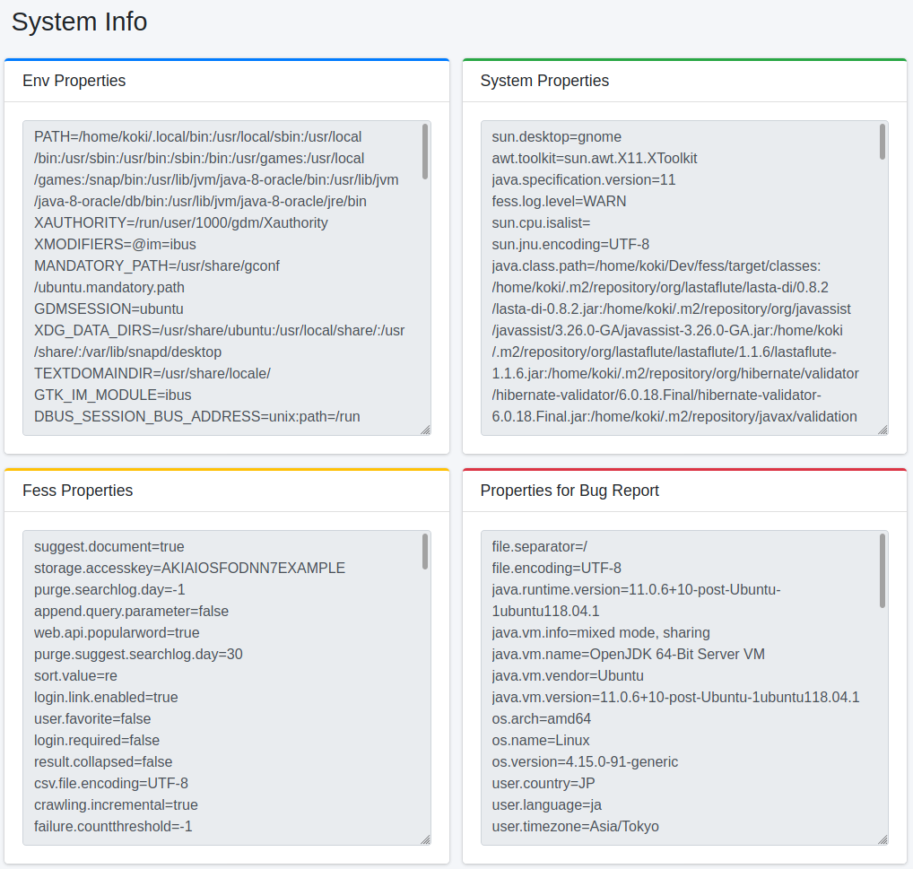

==================
Informations système
====================

Présentation
============

Ici, vous pouvez vérifier les informations de propriété telles que les variables d'environnement concernant le système actuellement en cours d'exécution.

Gestion
=======

Affichage
---------

Pour ouvrir la page d'informations système illustrée ci-dessous, cliquez sur [Informations système > Informations de configuration] dans le menu de gauche.

|image0|

Éléments affichés
-----------------

Propriétés des variables d'environnement
:::::::::::::::::::::::::::::::::::::::::

Vous pouvez lister les variables d'environnement du serveur.

Propriétés du système
::::::::::::::::::::::

Vous pouvez lister les propriétés système configurées dans |Fess|.

Propriétés de l'application
::::::::::::::::::::::::::::

Vous pouvez vérifier les informations de configuration de |Fess|.

Propriétés de rapport de bogue
:::::::::::::::::::::::::::::::

C'est une liste de propriétés à joindre lors du signalement d'un bogue.
Elle extrait les valeurs qui ne contiennent pas d'informations personnelles.

