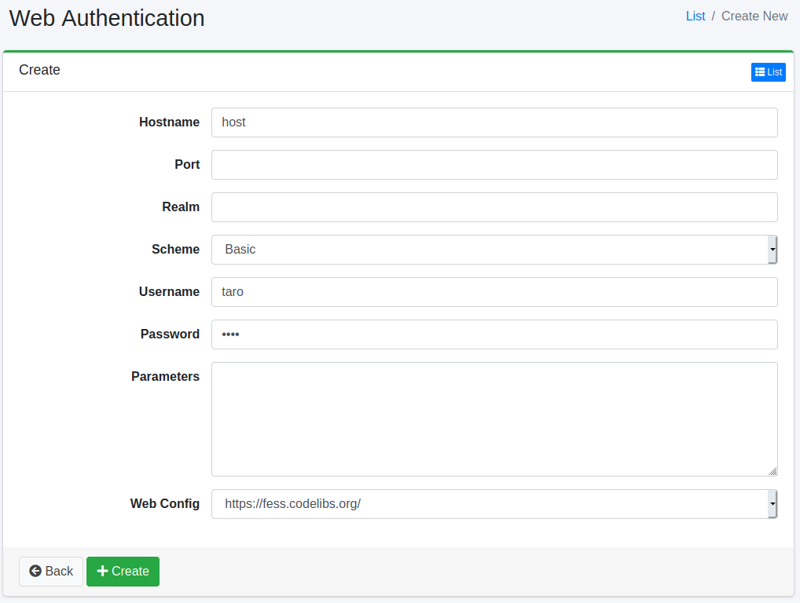

====================
Authentification Web
====================

Présentation
============

Cette section explique la méthode de configuration lorsqu'une authentification Web est requise pour le crawl ciblant le Web.
|Fess| prend en charge le crawl pour l'authentification BASIC, DIGEST et NTLM.

Gestion
=======

Affichage
---------

Pour ouvrir la page de liste de configuration d'authentification Web illustrée ci-dessous, cliquez sur [Crawler > Authentification Web] dans le menu de gauche.

|image0|

Cliquez sur le nom de la configuration pour la modifier.

Création de configuration
-------------------------

Cliquez sur le bouton Nouvelle création pour ouvrir la page de configuration d'authentification Web.

|image1|

Paramètres de configuration
---------------------------

Nom d'hôte
::::::::::

Spécifie le nom d'hôte du site nécessitant une authentification.
Si omis, il sera appliqué à tout nom d'hôte dans la configuration de crawl Web spécifiée.

Port
::::

Spécifie le port du site nécessitant une authentification.
Pour l'appliquer à tous les ports, spécifiez -1.
Dans ce cas, il sera appliqué à tout port dans la configuration de crawl Web spécifiée.

Domaine
:::::::

Spécifie le nom de domaine du site nécessitant une authentification.
Si omis, il sera appliqué à tout nom de domaine dans la configuration de crawl Web spécifiée.

Schéma
::::::

Sélectionnez la méthode d'authentification.
Vous pouvez utiliser l'authentification BASIC, DIGEST, NTLM ou FORM.

Nom d'utilisateur
:::::::::::::::::

Spécifie le nom d'utilisateur pour se connecter au site d'authentification.

Mot de passe
::::::::::::

Spécifie le mot de passe pour se connecter au site d'authentification.

Paramètres
::::::::::

Configure s'il existe des valeurs de configuration nécessaires pour se connecter au site d'authentification.
Pour l'authentification NTLM, vous pouvez définir les valeurs de workstation et domain.
Pour les configurer, décrivez comme suit :

::

    workstation=HOGE
    domain=FUGA

Configuration Web
:::::::::::::::::

Sélectionnez le nom de configuration Web auquel appliquer les paramètres d'authentification ci-dessus.
Vous devez enregistrer la configuration de crawl Web au préalable.

Suppression de configuration
----------------------------

Cliquez sur le nom de la configuration dans la page de liste, puis cliquez sur le bouton Supprimer pour afficher l'écran de confirmation.
Appuyer sur le bouton Supprimer supprimera la configuration.

.. |image0| image:: ../../../resources/images/en/15.3/admin/webauth-1.png

