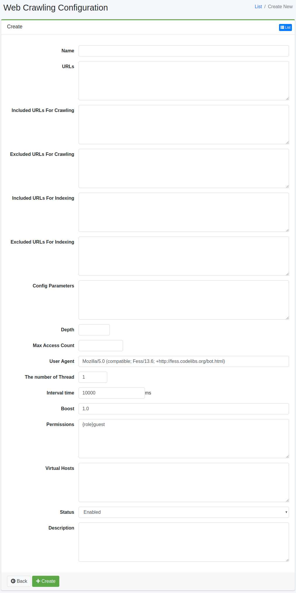

==============
Crawl Web
==============

Présentation
============

La page de configuration de crawl Web configure le crawl Web.

Gestion
=======

Affichage
---------

Pour ouvrir la page de liste de configuration de crawl Web illustrée ci-dessous, cliquez sur [Crawler > Web] dans le menu de gauche.

|image0|

Cliquez sur le nom de la configuration pour la modifier.

Création de configuration
--------------------------

Cliquez sur le bouton Créer pour ouvrir la page de configuration de crawl Web.

|image1|

Paramètres de configuration
----------------------------

Nom
::::

Nom de la configuration.

URL
::::

URL de départ du crawl.

URL à crawler
:::::::::::::

Les URL correspondant à l'expression régulière (format Java) spécifiée dans cet élément seront ciblées par le crawler |Fess|.

URL exclues du crawl
::::::::::::::::::::

Les URL correspondant à l'expression régulière (format Java) spécifiée dans cet élément ne seront pas ciblées par le crawler |Fess|.

URL à indexer
:::::::::::::

Les URL correspondant à l'expression régulière (format Java) spécifiée dans cet élément seront ciblées pour la recherche.

URL exclues de l'indexation
::::::::::::::::::::::::::::

Les URL correspondant à l'expression régulière (format Java) spécifiée dans cet élément ne seront pas ciblées pour la recherche.

Paramètres de configuration
::::::::::::::::::::::::::::

Vous pouvez spécifier les informations de configuration du crawl.

Profondeur
::::::::::

Vous pouvez spécifier la profondeur lors du suivi des liens contenus dans les documents crawlés.

Nombre maximum d'accès
::::::::::::::::::::::

Nombre d'URL à indexer.

Agent utilisateur
:::::::::::::::::

Nom du crawler |Fess|.

Nombre de threads
:::::::::::::::::

Nombre de threads pour crawler dans cette configuration.

Intervalle
::::::::::

Intervalle de temps pour chaque thread lors du crawl d'URL.

Valeur de boost
:::::::::::::::

Poids des documents indexés dans cette configuration.

Permission
::::::::::

Spécifie la permission pour cette configuration.
Pour la méthode de spécification de permission, par exemple, pour afficher les résultats de recherche aux utilisateurs appartenant au groupe developer, spécifiez {group}developer.
La spécification par utilisateur est {user}nom_utilisateur, par rôle {role}nom_rôle, par groupe {group}nom_groupe.

Hôte virtuel
::::::::::::

Spécifie le nom d'hôte de l'hôte virtuel.
Pour plus de détails, consultez :doc:`../config/virtual-host`.

État
::::

Si activé, la tâche planifiée du crawler par défaut inclura cette configuration.

Description
:::::::::::

Vous pouvez saisir une description.

Suppression de configuration
-----------------------------

Cliquez sur le nom de la configuration dans la page de liste, puis cliquez sur le bouton Supprimer pour afficher l'écran de confirmation. Appuyer sur le bouton Supprimer supprimera la configuration.

Exemples
========

Crawler fess.codelibs.org
-------------------------

Pour créer une configuration de crawl Web qui crawle les pages sous https://fess.codelibs.org/, les valeurs de configuration seraient les suivantes.

.. tabularcolumns:: |p{4cm}|p{8cm}|
.. list-table::
   :header-rows: 1

   * - Élément de configuration
     - Valeur de configuration
   * - Nom
     - Fess
   * - URL
     - https://fess.codelibs.org/
   * - URL à crawler
     - https://fess.codelibs.org/.*

Les autres valeurs de configuration utilisent les valeurs par défaut.

Crawl Web de site avec authentification Web
--------------------------------------------

Fess prend en charge le crawl pour l'authentification BASIC, DIGEST et NTLM.
Pour plus de détails sur l'authentification Web, consultez la page d'authentification Web.

Redmine
:::::::

Pour créer une configuration de crawl Web qui crawle les pages de Redmine protégées par mot de passe (ex. https://<serveur>/), les valeurs de configuration seraient les suivantes.

.. tabularcolumns:: |p{4cm}|p{8cm}|
.. list-table::
   :header-rows: 1

   * - Élément de configuration
     - Valeur de configuration
   * - Nom
     - Redmine
   * - URL
     - https://<serveur>/my/page
   * - URL à crawler
     - https://<serveur>/.*
   * - Paramètres de configuration
     - client.robotsTxtEnabled=false (Optionnel)

Ensuite, créez la configuration d'authentification Web avec les valeurs suivantes.

.. tabularcolumns:: |p{4cm}|p{8cm}|
.. list-table::
   :header-rows: 1

   * - Élément de configuration
     - Valeur de configuration
   * - Schéma
     - Form
   * - Nom d'utilisateur
     - (Compte pour le crawl)
   * - Mot de passe
     - (Mot de passe du compte)
   * - Paramètres
     - | encoding=UTF-8
       | token_method=GET
       | token_url=https://<serveur>/login
       | token_pattern=name="authenticity_token"[^>]+value="([^"]+)"
       | token_name=authenticity_token
       | login_method=POST
       | login_url=https://<serveur>/login
       | login_parameters=username=${username}&password=${password}
   * - Authentification Web
     - Redmine

XWiki
:::::

Pour créer une configuration de crawl Web qui crawle les pages de XWiki (ex. https://<serveur>/xwiki/), les valeurs de configuration seraient les suivantes.

.. tabularcolumns:: |p{4cm}|p{8cm}|
.. list-table::
   :header-rows: 1

   * - Élément de configuration
     - Valeur de configuration
   * - Nom
     - XWiki
   * - URL
     - https://<serveur>/xwiki/bin/view/Main/
   * - URL à crawler
     - https://<serveur>/.*
   * - Paramètres de configuration
     - client.robotsTxtEnabled=false (Optionnel)

Ensuite, créez la configuration d'authentification Web avec les valeurs suivantes.

.. tabularcolumns:: |p{4cm}|p{8cm}|
.. list-table::
   :header-rows: 1

   * - Élément de configuration
     - Valeur de configuration
   * - Schéma
     - Form
   * - Nom d'utilisateur
     - (Compte pour le crawl)
   * - Mot de passe
     - (Mot de passe du compte)
   * - Paramètres
     - | encoding=UTF-8
       | token_method=GET
       | token_url=http://<serveur>/xwiki/bin/login/XWiki/XWikiLogin
       | token_pattern=name="form_token" +value="([^"]+)"
       | token_name=form_token
       | login_method=POST
       | login_url=http://<serveur>/xwiki/bin/loginsubmit/XWiki/XWikiLogin
       | login_parameters=j_username=${username}&j_password=${password}
   * - Authentification Web
     - XWiki

.. pdf            :height: 940 px
