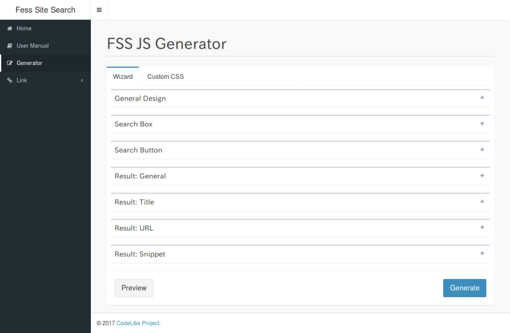
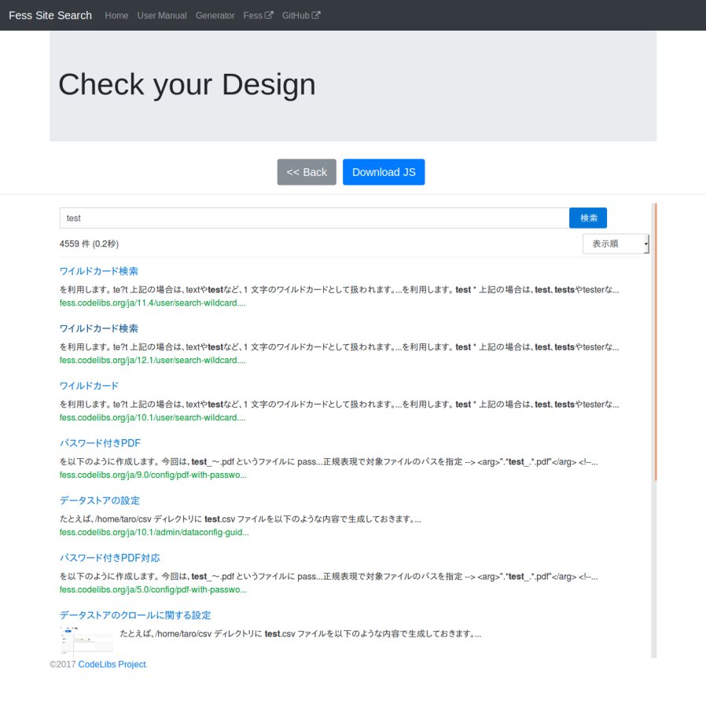
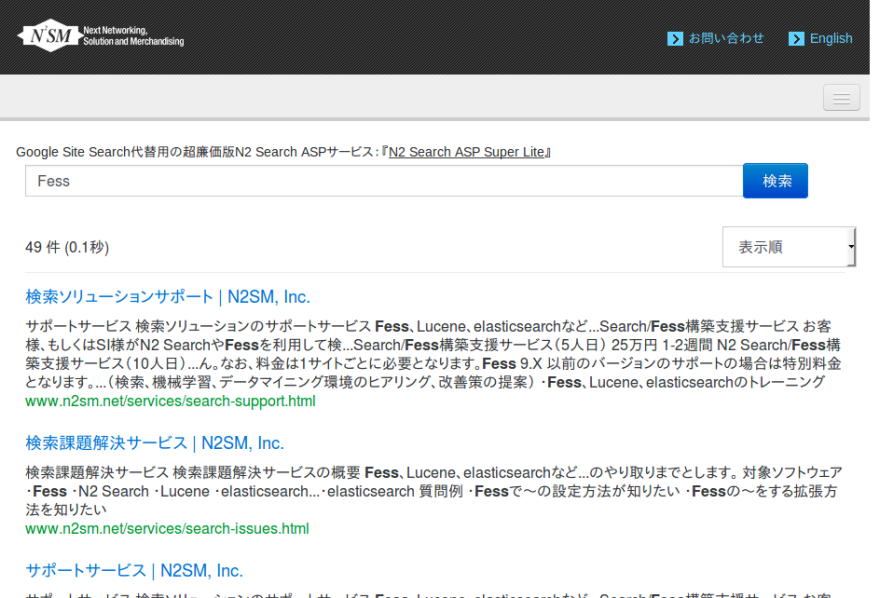

=====================================================================
Construire un serveur de recherche basé sur Elasticsearch avec Fess ~ FSS
=====================================================================

Introduction
============

Nous allons vous montrer comment integrer un service de recherche dans votre site Web en utilisant un serveur Fess que vous avez mis en place.
En utilisant les balises et les fichiers JavaScript fournis par Fess Site Search (FSS), vous pouvez afficher une zone de recherche et des resultats de recherche sur un site Web existant.

Public cible
============

- Ceux qui souhaitent ajouter une fonction de recherche a un site Web existant

- Ceux qui souhaitent migrer depuis Google Site Search ou Google Custom Search.

Qu'est-ce que Fess Site Search (FSS) ?
=======================================

FSS est une fonctionnalite qui permet d'integrer le serveur de recherche Fess dans un site Web existant. Elle est proposee par le projet CodeLibs sur le site FSS. De la meme maniere que la recherche interne de site comme Google Site Search (GSS), il suffit d'integrer une balise JavaScript dans la page ou vous souhaitez utiliser le service de recherche, ce qui facilite egalement la migration depuis GSS.

FSS JS
======

FSS JS est un fichier JavaScript qui affiche les resultats de recherche de Fess. En placant ce fichier JavaScript sur votre site Web, vous pourrez afficher les resultats de recherche.
FSS JS peut etre obtenu en le generant avec le FSS JS Generator disponible a l'adresse ``https://fss-generator.codelibs.org/``.
FSS JS est compatible avec Fess version 11.3 et superieure. Veuillez donc installer Fess 11.3 ou une version ulterieure lors de la mise en place de Fess. Pour la methode de mise en place de Fess, veuillez consulter le \ `guide d'introduction <https://fess.codelibs.org/ja/articles/article-1.html>`__\ .

Le FSS JS Generator vous permet de specifier les couleurs du formulaire de recherche et la police des caracteres.
En cliquant sur le bouton "Generate", vous pouvez generer un fichier JavaScript avec les parametres specifies.

|image0|

Si l'apercu ne pose pas de probleme, cliquez sur le bouton "Download JS" pour telecharger le fichier JavaScript.

|image1|

Integration dans le site
=========================

Dans cet exemple, nous allons integrer une recherche interne dans le site ``www.n2sm.net``, compose de pages HTML statiques.

Les resultats de recherche seront affiches sur la page search.html du site, et le serveur Fess sera mis en place separement sur ``nss833024.n2search.net``.

Le fichier JavaScript FSS JS telecharge sera place sur le site a l'emplacement /js/fess-ss.min.js.

Les informations ci-dessus sont resumees dans le tableau suivant.

.. tabularcolumns:: |p{4cm}|p{8cm}|
.. list-table::

   * - Nom
     - URL
   * - Site cible de la recherche
     - https://www.n2sm.net/
   * - Page des resultats de recherche
     - https://www.n2sm.net/search.html
   * - FSS JS
     - https://www.n2sm.net/js/fess-ss.min.js
   * - Serveur Fess
     - https://nss833024.n2search.net/

Pour integrer la balise JavaScript, placez le code suivant a l'endroit ou vous souhaitez afficher les resultats de recherche dans search.html.

..
  
  <fess:search></fess:search>

En accedant a search.html, le formulaire de recherche s'affiche.

Lorsque vous saisissez un terme de recherche, les resultats de recherche s'affichent comme suit.

|image2|

Pour placer un formulaire de recherche sur d'autres pages et afficher les resultats de recherche, placez un formulaire de recherche comme celui ci-dessous sur chaque page et configurez-le pour rediriger vers ``https://www.n2sm.net/search.html?q=terme+de+recherche``.

..
  <form action="https://www.n2sm.net/search.html" method="get">
    <input type="text" name="q">
    <input type="submit" value="Rechercher">
  </form>

Conclusion
==========

Nous avons presente comment integrer les resultats de recherche de Fess dans un site en placant simplement une balise JavaScript.
Grace a FSS, la migration depuis GSS peut egalement etre realisee en remplacant simplement les balises JavaScript existantes.
FSS JS offre egalement d'autres methodes d'affichage et des fonctionnalites d'integration des journaux de recherche avec Google Analytics. Pour les autres methodes de configuration, veuillez consulter le `[manuel] de FSS <https://fss-generator.codelibs.org/ja/docs/manual>`__.

References
==========
- `Fess Site Search <https://fss-generator.codelibs.org/ja/>`__

