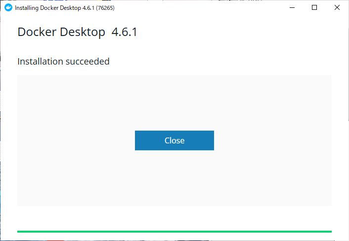

================
Procédure d'installation
================

Méthode d'installation
================

Fess fournit des distributions sous forme d'archives ZIP, de packages RPM/DEB et d'images Docker.
En utilisant Docker, vous pouvez facilement configurer Fess sur Windows, Mac, etc.

Si vous construisez un environnement de production, veuillez absolument consulter :doc:`15.3/install/index`.

.. warning::

   **Notes importantes pour l'environnement de production**

   Pour les environnements de production ou les tests de charge, l'utilisation d'OpenSearch intégré n'est pas recommandée.
   Veuillez obligatoirement construire un serveur OpenSearch externe.

Installation de Docker Desktop
============================

Nous allons expliquer ici la méthode d'utilisation sur Windows.
Si Docker Desktop n'est pas installé, veuillez l'installer en suivant la procédure ci-dessous.

Les fichiers à télécharger et les procédures diffèrent selon le système d'exploitation, vous devez donc suivre les étapes adaptées à votre environnement.
Pour plus de détails, veuillez consulter la documentation de `Docker <https://docs.docker.com/get-docker/>`_.

Téléchargement
------------

Téléchargez le programme d'installation pour le système d'exploitation correspondant sur `Docker Desktop <https://www.docker.com/products/docker-desktop/>`__.

Exécution du programme d'installation
--------------------

Double-cliquez sur le programme d'installation téléchargé pour démarrer l'installation.

Vérifiez que «Install required Windows components for WSL 2» ou
«Install required Enable Hyper-V Windows Features» est sélectionné,
puis cliquez sur le bouton OK.

|image0|

Une fois l'installation terminée, cliquez sur le bouton «close» pour fermer l'écran.

|image1|

Démarrage de Docker Desktop
---------------------

Cliquez sur «Docker Desktop» dans le menu Windows pour le démarrer.

|image2|

Après le démarrage de Docker Desktop, les conditions d'utilisation s'affichent. Cochez «I accept the terms» et cliquez sur le bouton «Accept».

Un message vous invite à commencer le tutoriel, mais cliquez ici sur «Skip tutorial» pour le passer.
Après avoir cliqué sur «Skip tutorial», le tableau de bord s'affiche.

|image3|

Configuration
====

Pour permettre à OpenSearch de s'exécuter en tant que conteneur Docker, ajustez la valeur de «vm.max_map_count» du côté du système d'exploitation.
La méthode de configuration varie selon l'environnement utilisé. Pour chaque méthode de configuration, veuillez consulter «`Set vm.max_map_count to at least 262144 <https://www.elastic.co/guide/en/elasticsearch/reference/current/docker.html#_set_vm_max_map_count_to_at_least_262144>`_».

Configuration de Fess
==================

Création du fichier de démarrage
------------------

Créez un dossier approprié et téléchargez `compose.yaml <https://raw.githubusercontent.com/codelibs/docker-fess/master/compose/compose.yaml>`_ et `compose-opensearch3.yaml <https://raw.githubusercontent.com/codelibs/docker-fess/master/compose/compose-opensearch3.yaml>`_.

Vous pouvez également les obtenir avec la commande curl comme suit.

::

    curl -o compose.yaml https://raw.githubusercontent.com/codelibs/docker-fess/master/compose/compose.yaml
    curl -o compose-opensearch3.yaml https://raw.githubusercontent.com/codelibs/docker-fess/master/compose/compose-opensearch3.yaml

Démarrage de Fess
----------

Démarrez Fess avec la commande docker compose.

Ouvrez l'invite de commandes, déplacez-vous vers le dossier contenant le fichier compose.yaml et exécutez la commande suivante.

::

    docker compose -f compose.yaml -f compose-opensearch3.yaml up -d

.. note::

   Le démarrage peut prendre plusieurs minutes.
   Vous pouvez vérifier les journaux avec la commande suivante::

       docker compose -f compose.yaml -f compose-opensearch3.yaml logs -f

   Appuyez sur ``Ctrl+C`` pour quitter l'affichage des journaux.

Vérification du fonctionnement
========

Vous pouvez vérifier le démarrage en accédant à \http://localhost:8080/.

L'interface d'administration est accessible à \http://localhost:8080/admin/.
Le nom d'utilisateur/mot de passe par défaut du compte administrateur est admin/admin.

.. warning::

   **Note importante concernant la sécurité**

   Veuillez obligatoirement modifier le mot de passe par défaut.
   En particulier en environnement de production, il est fortement recommandé de changer le mot de passe immédiatement après la première connexion.

Le compte administrateur est géré par le serveur d'applications.
L'interface d'administration de Fess considère comme administrateur un utilisateur authentifié avec le rôle fess sur le serveur d'applications.

Autres
======

Arrêt de Fess
----------

Pour arrêter Fess, exécutez la commande suivante dans le dossier où Fess a été démarré.

::

    docker compose -f compose.yaml -f compose-opensearch3.yaml stop

Pour arrêter et supprimer les conteneurs::

    docker compose -f compose.yaml -f compose-opensearch3.yaml down

.. warning::

   Si vous souhaitez également supprimer les volumes avec la commande ``down``, ajoutez l'option ``-v``.
   Dans ce cas, toutes les données seront supprimées, soyez donc prudent::

       docker compose -f compose.yaml -f compose-opensearch3.yaml down -v

Modification du mot de passe administrateur
----------------------

Vous pouvez le modifier dans l'écran d'édition des utilisateurs de l'interface d'administration.

.. |image0| image:: ../resources/images/ja/install/dockerdesktop-1.png

.. |image2| image:: ../resources/images/ja/install/dockerdesktop-3.png
.. |image3| image:: ../resources/images/ja/install/dockerdesktop-4.png
