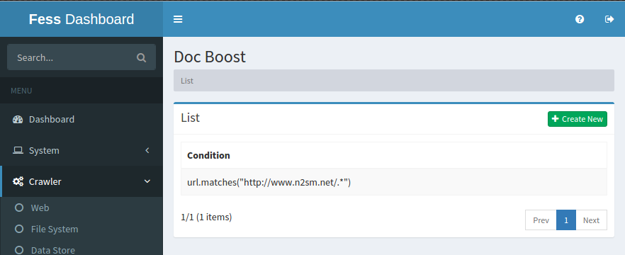
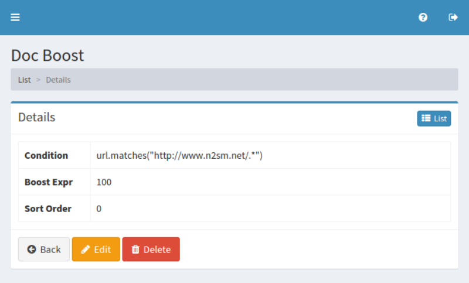

==========================
ドキュメントブーストの設定
==========================

概要
====

.. TODO import from fess9 docs
.. 概要、設定項目
ここでは、ドキュメントブーストに関する設定について説明します。 ドキュメントブーストの設定を行うことで、検索語に関わらず検索結果の上位にドキュメントを位置づけることができます。

管理方法
========

表示方法
--------

下図のドキュメントブーストの設定一覧ページを開くには、左メニューの [クローラ > ドキュメントブースト] をクリックします。

|image0|

編集するには設定名をクリックします。

設定の作成
----------

ドキュメントブーストの設定ページを開くには新規作成ボタンをクリックします。

|image1|

設定項目
--------

条件
::::

上位に位置づけたいドキュメントのURLパターンを指定します。

ブースト値式
::::::::::::

ドキュメントの重み付けの値を指定します。

ソート順
::::::::

ドキュメントブーストのソート順を設定します。

設定の削除
----------

一覧ページの設定名をクリックし、削除ボタンをクリックすると確認画面が表示されます。さらに削除ボタンを押すと設定が削除されます。

例
==

TBD
--------------------------

TBD

