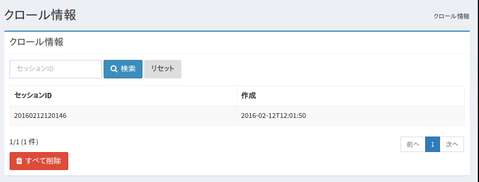

==================
クロール情報の管理
==================

概要
========

クロールの実行結果は記録され、クロール情報はこの管理画面で確認することができます。

一覧
====

クロールが実行されるごとにクロール情報として記録されます。
一覧では実行したクロールのセッション名と実行した時間が確認することができます。
クロール情報の詳細を確認したい場合は対象のクロール情報をクリックします。

|image0|

詳細
====

TBD
----------

TBD

.. TODO 画像
