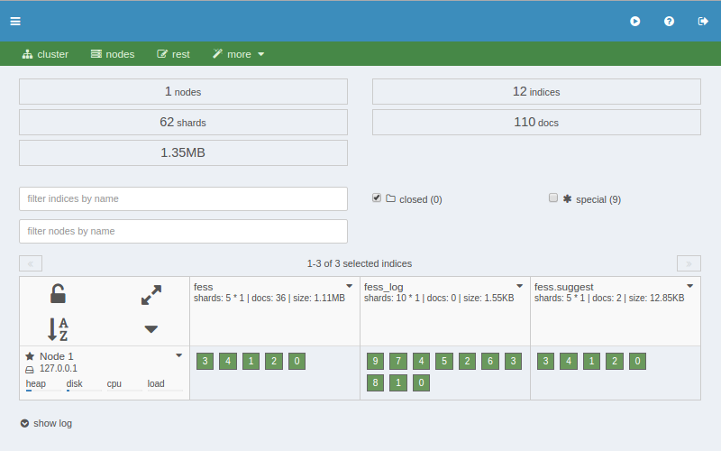

====================
ダッシュボードの設定
====================

概要
====

ダッシュボードでは、 elasticsearch のためのクラスタとインデックスを管理するウェブ管理ツールを提供します。

|image0|

|Fess| が管理するインデックス:

* fess: インデックスされたドキュメント
* fess_log: アクセスログ
* fess.suggest: サジェストワード
* .fess_config: fess の設定
* .fess_user: ユーザー/ロール/グループのデータ
* .configsync: 辞書の設定
* .suggest: サジェストのメタデータ
* .suggest-array: サジェストのメタデータ
* .suggest-badword: サジェストのNGワードリスト

インデックスされているドキュメントの数を確認するには
====================================================

インデックスされているドキュメントの数は、下図のように fessインデックス に表示されています。

|image1|

.. |image1| image:: ../../../resources/images/ja/10.0/admin/dashboard-2.png
