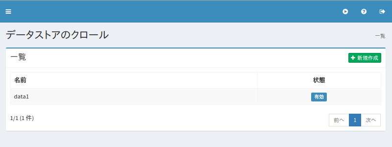
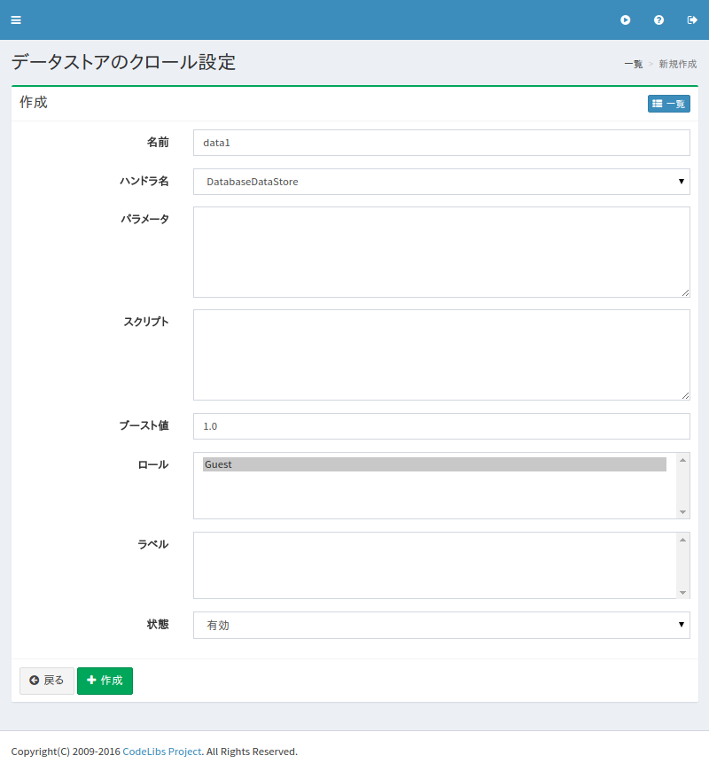

==================
データストアの設定
==================

概要
====

.. TODO import from fess9 docs
.. 概要、設定項目(ハンドラはFileListDataStoreが追加されたためTBD)
Fess ではデータベースやCSVなどのデータソースをクロール対象とすることができます。ここでは、そのために必要なデータストアの設定について説明します。

管理方法
========

表示方法
--------

下図のデータストアの設定を行うための一覧ページを開くには、左メニューの [クローラ > データストア] をクリックします。

|image0|

編集するには設定名をクリックします。

設定の作成
----------

データストアの設定ページを開くには新規作成ボタンをクリックします。

|image1|

設定項目
--------

名前
::::

クロール設定の名前を指定します。

ハンドラ名
::::::::::

.. データストアを処理するハンドラ名です。 データベースをクロールする場合はDatabaseDataStoreを選択し、CSVファイルを対象としてクロールする場合はCsvDataStoreを選択し、ファイルのリストから選択する場合はFileListDataStoreを選択してください。
TBD

パラメータ
::::::::::

データストアに関するパラメータを指定します。

スクリプト
::::::::::

データストアから取得した値をどのフィールドに設定するかなどを指定します。 OGNL式が記述することができます。

ブースト値
::::::::::

この設定でクロールしたときのドキュメントのブースト値を指定します。

ロール
::::::

ロール検索を利用する場合、このクロール設定のロールを指定します。

ラベル
::::::

このクロール設定でクロールしたときのラベルを指定します。

状態
::::

このクロール設定を利用するかどうかを指定します。

設定の削除
----------

一覧ページの設定名をクリックし、削除ボタンをクリックすると確認画面が表示されます。さらに削除ボタンを押すと設定が削除されます。

