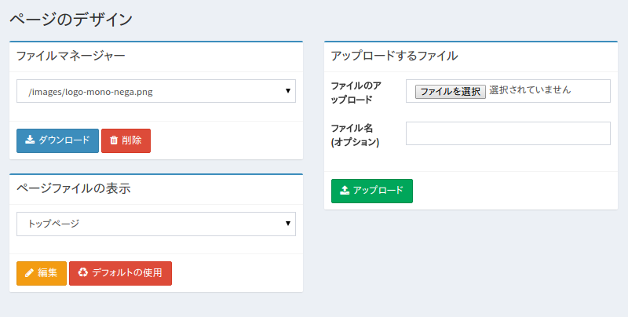

======================
ページのデザインの設定
======================

概要
====

.. TODO import from fess9 docs
.. 設定項目
ここでは、検索画面のデザインに関する設定について説明します。

設定方法
========

表示方法
--------

下図のページのデザインの設定を行うための一覧ページを開くには、左メニューの [システム > ページのデザイン] をクリックします。

|image0|

|image1|

設定項目
========

ファイルマネージャー
--------------------

検索画面で利用可能なファイルをダウンロードや削除することができます。

ページファイルの表示
--------------------

検索画面で使用するファイルをアップロードすることができます。サポートしている画像ファイル名は jpg、gif、png、css、js です。

ファイル名
----------

アップロードするファイルにファイル名を指定したい場合に利用します。省略した場合はアップロードしたファイル名が利用されます。

アップロードするファイル
------------------------

検索画面の JSP ファイルを編集することができます。対象の JSP ファイルの編集ボタンを押下することで、現在の JSP ファイルを編集することができます。また、デフォルトを使用ボタンを押下すると、インストール時の JSP ファイルとして編集することができます。編集画面で更新ボタンで保存することで、変更が反映されます。

以下に記述方法の例を示します。

+----------------------------------------+----------------------------------------------------------------------------------------------------------------------------------------------------------------------+
| トップページ                           | 検索トップページの JSP ファイルです。この JSP ファイルが各部分の JSP ファイルを include しています。                                                                 |
+----------------------------------------+----------------------------------------------------------------------------------------------------------------------------------------------------------------------+
| ヘッダー                               | ヘッダーのJSPファイルです。                                                                                                                                          |
+----------------------------------------+----------------------------------------------------------------------------------------------------------------------------------------------------------------------+
| フッター                               | フッターのJSPファイルです。                                                                                                                                          |
+----------------------------------------+----------------------------------------------------------------------------------------------------------------------------------------------------------------------+
| 検索結果ページ (フレーム)              | 検索結果一覧ページの JSP ファイルです。この JSP ファイルが各部分の JSP ファイルを include しています。                                                               |
+----------------------------------------+----------------------------------------------------------------------------------------------------------------------------------------------------------------------+
| 検索結果ページ (コンテンツ)            | 検索結果一覧ページの検索結果部分を表現する JSP ファイルです。検索結果があるときに利用される JSP ファイルです。検索結果の表現をカスタマイズしたい場合に変更します。   |
+----------------------------------------+----------------------------------------------------------------------------------------------------------------------------------------------------------------------+
| 検索結果ページ (結果なし)              | 検索結果一覧ページの検索結果部分を表現する JSP ファイルです。検索結果がないときに利用される JSP ファイルです。                                                       |
+----------------------------------------+----------------------------------------------------------------------------------------------------------------------------------------------------------------------+
| ヘルプページ(コンテンツ)               | ヘルプページのJSPファイルです。                                                                                                                                      |
+----------------------------------------+----------------------------------------------------------------------------------------------------------------------------------------------------------------------+
| キャッシュページ                       | TBD                                                                                                                                                                  |
+----------------------------------------+----------------------------------------------------------------------------------------------------------------------------------------------------------------------+
| 検索エラーページ                       | 検索エラーページのJSPファイルです。検索エラーの表現をカスタマイズしたい場合に変更します。                                                                            |
+----------------------------------------+----------------------------------------------------------------------------------------------------------------------------------------------------------------------+
| エラーページ(ヘッダー)                 | エラーページのヘッダー部分を表現するJSPファイルです。                                                                                                                |
+----------------------------------------+----------------------------------------------------------------------------------------------------------------------------------------------------------------------+
| エラーページ(フッター)                 | エラーページのフッター部分を表現するJSPファイルです。                                                                                                                |
+----------------------------------------+----------------------------------------------------------------------------------------------------------------------------------------------------------------------+
| エラーページ(見つかりません)           | ページが見つからない場合に表示されるエラーページのJSPファイルです。                                                                                                  |
+----------------------------------------+----------------------------------------------------------------------------------------------------------------------------------------------------------------------+
| エラーページ(システムエラー)           | システムエラーの場合に表示されるエラーページのJSPファイルです。                                                                                                      |
+----------------------------------------+----------------------------------------------------------------------------------------------------------------------------------------------------------------------+
| エラーページ(リダイレクト)             | HTTPリダイレクト発生時に表示されるエラーページのJSPファイルです。                                                                                                    |
+----------------------------------------+----------------------------------------------------------------------------------------------------------------------------------------------------------------------+
| エラーページ(BadRequest)               | 不正なリクエストが発生時に表示されるエラーページのJSPファイルです。                                                                                                  |
+----------------------------------------+----------------------------------------------------------------------------------------------------------------------------------------------------------------------+

Table: 編集可能なJSPファイル

TBD

.. |image1| image:: ../../../resources/images/ja/10.0/admin/design-2.png
