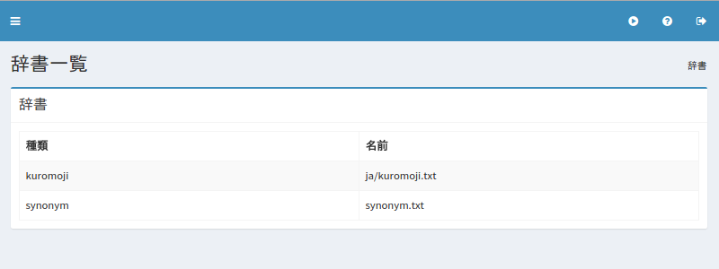

==========
辞書の設定
==========

概要
====

ここでは、辞書に関する設定について説明します。

一覧
====

下図の管理可能な辞書一覧ページを開くには、左メニューの [システム > 辞書] をクリックします。

|image0|

synonym
=======

同義語辞書の管理をします。
synonym.txtは言語共通で利用される同義語辞書ファイルになります。
管理方法については :doc:`synonym-guide` を参照してください。

kuromoji
========

日本語形態素解析用の辞書を管理します。
ja/kuromoji.txt に日本語のドキュメントに対して適用されます。
管理方法については :doc:`kuromoji-guide` を参照してください。

