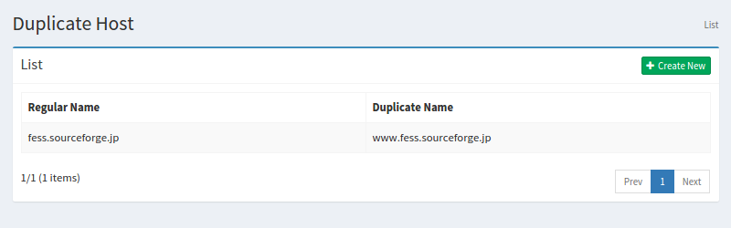
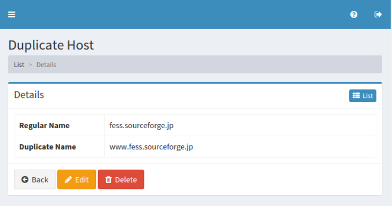

================
重複ホストの設定
================

概要
====

TBD

管理方法
========

表示方法
--------

下図の重複ホストの設定を行うための一覧ページを開くには、左メニューの [クローラ > 重複ホスト] をクリックします。

|image0|

編集するには設定名をクリックします。

設定の作成
----------

重複ホストの設定ページを開くには新規作成ボタンをクリックします。

|image1|

設定項目
--------

正規名
::::::

TBD

重複名
::::::

TBD

設定の削除
----------

リストページの設定名をクリックし、削除ボタンをクリックすると確認画面が表示されます。さらに削除ボタンを押すと設定が削除されます。

例
==

TBD
--------------------------

TBD

