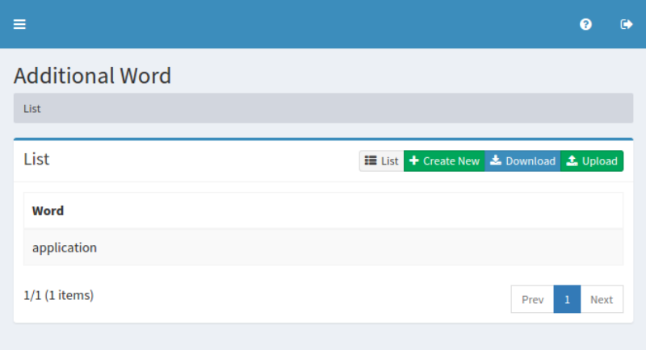
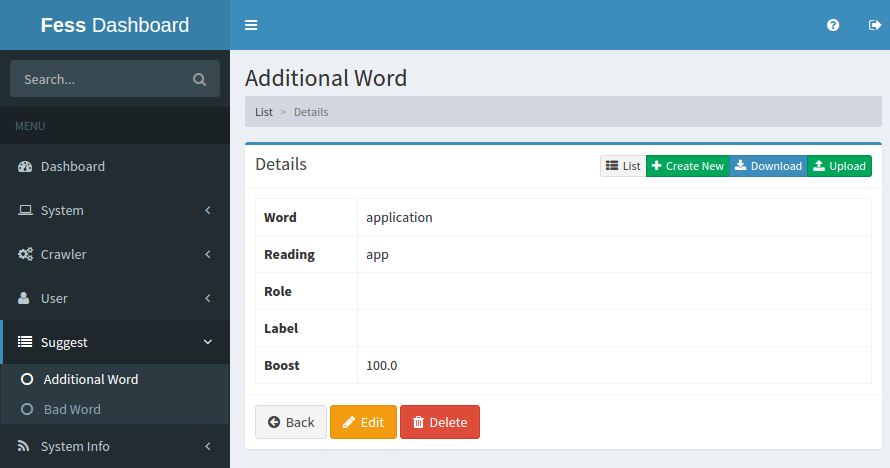
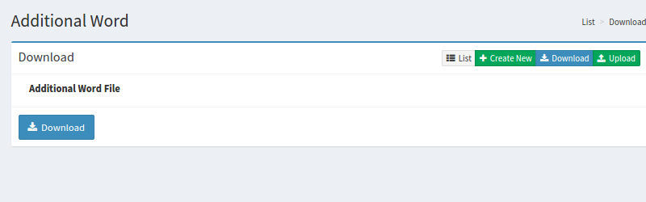
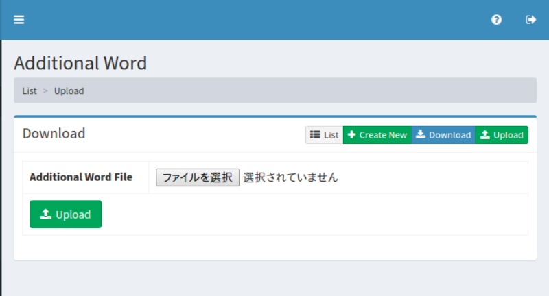

============================
サジェストの追加ワードの設定
============================

概要
====

TBD

|image0|

管理方法
========

表示方法
--------

下図の追加ワードの設定を行うための一覧ページを開くには、左メニューの [サジェスト > 追加ワード] をクリックします。

|image0|

編集するには設定名をクリックします。

設定の作成
----------

追加ワードの設定ページを開くには新規作成ボタンをクリックします。

|image1|

設定項目
--------

単語
::::

TBD

読み
::::

TBD

ロール
::::::

TBD

ラベル
::::::

TBD

ブースト値
::::::::::

TBD

設定の削除
----------

リストページの設定名をクリックし、削除ボタンをクリックすると確認画面が表示されます。さらに削除ボタンを押すと設定が削除されます。

例
==

TBD
--------------------------

TBD

ダウンロード
============

TBD

|image3|

CSVの内容
---------

TBD

アップロード
============

TBD

|image4|

CSVの内容
---------

TBD

.. |image0| image:: ../../../resources/images/en/10.0/admin/elevateword-1.png

