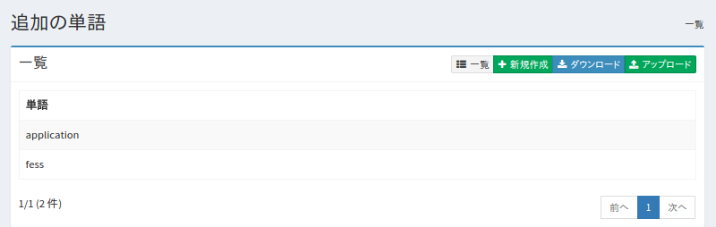
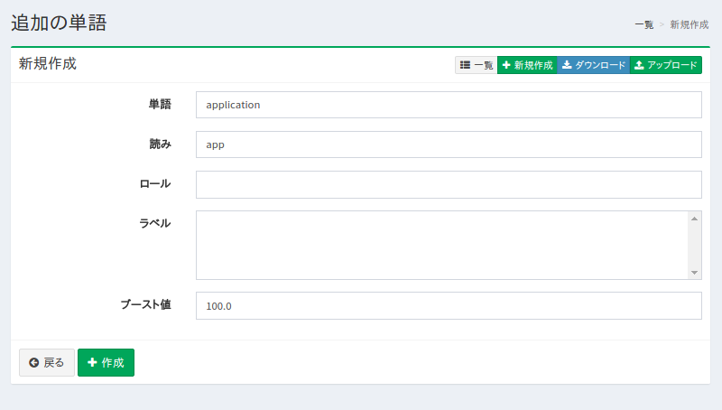
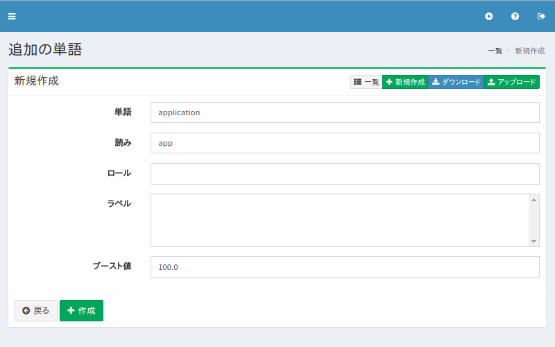
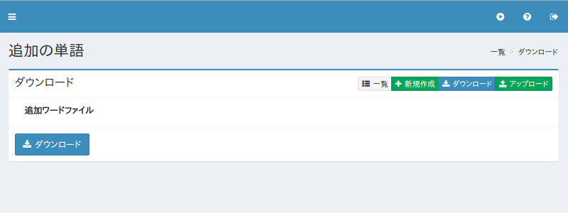
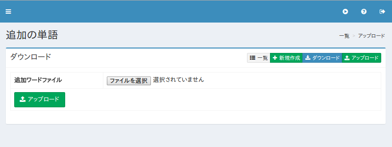

============================
サジェストの追加ワードの設定
============================

概要
====

.. TODO import from fess9 docs
.. 概要、設定項目、ダウンロード、アップロード
ここでは、サジェストのワードの追加候補の設定について説明します。 サジェストは検索語に応じて表示されますが、そのワードを追加したりすることができます。

|image0|

管理方法
========

表示方法
--------

下図の追加ワードの設定を行うための一覧ページを開くには、左メニューの [サジェスト > 追加ワード] をクリックします。

|image0|

編集するには設定名をクリックします。

設定の作成
----------

追加ワードの設定ページを開くには新規作成ボタンをクリックします。

|image1|

設定項目
--------

単語
::::

サジェストに表示するワードを指定します。

読み
::::

ワードのよみがなを指定します。

ロール
::::::

ワードにロール情報を設定します。 設定したロールを持っているユーザーしかサジェストに表示されません。

ラベル
::::::

ワードにラベルを設定します。 設定したラベル以外を選択している場合はサジェストに表示されません。

ブースト値
::::::::::

ワードにブースト値を設定します。

設定の削除
----------

一覧ページの設定名をクリックし、削除ボタンをクリックすると確認画面が表示されます。さらに削除ボタンを押すと設定が削除されます。

例
==

TBD
--------------------------

TBD

ダウンロード
============

登録したワードをCSV形式でダウンロードします。

|image3|

CSVの内容
---------

1行目はヘッダです。

::

"SuggestWord","Reading","Role","Label","Boost"
"fess","ふぇす","role1","label1","100"

アップロード
============

CSV形式でワードを登録します。

|image4|

CSVの内容
---------

1行目はヘッダです。

::

"SuggestWord","Reading","Role","Label","Boost"
"fess","ふぇす","role1","label1","100"

