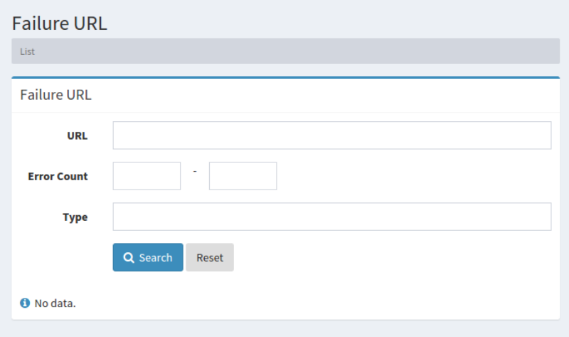

=============
障害URLの設定
=============

概要
====

.. TODO import from fess9 docs
.. 概要
ここでは、障害 URL について説明します。クロール時に取得できなかった URL が記録され、障害 URL として確認することができます。

管理方法
========

表示方法
--------

障害 URL を確認するための一覧ページを開くには、左メニューの [システム情報 > 障害URL] をクリックします。

|image0|

障害 URL の確認リンクをクリックすると、詳細が表示されます。

TBD
============

TBD
----------

TBD

