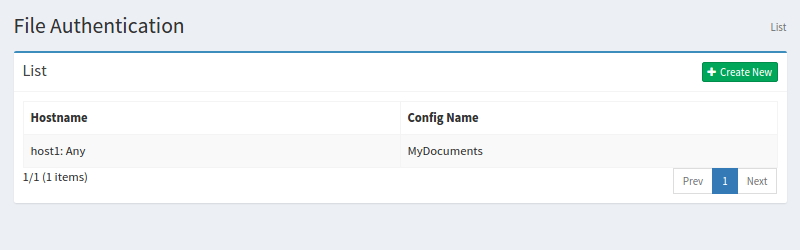

==================
ファイル認証の設定
==================

概要
====

TBD

管理方法
========

表示方法
--------

下図のファイル認証の設定を行うための一覧ページを開くには、左メニューの [クローラ > ファイル認証] をクリックします。

|image0|

編集するには設定名をクリックします。

設定の作成
----------

ファイル認証の設定ページを開くには新規作成ボタンをクリックします。

|image1|

設定項目
--------

ホスト名
::::::::

TBD

ポート
::::::

TBD

スキーム
::::::::

TBD

ユーザー名
::::::::::

TBD

パスワード
::::::::::

TBD

パラメータ
::::::::::

TBD

ファイルクロール設定
::::::::::::::::::::

TBD

設定の削除
----------

リストページの設定名をクリックし、削除ボタンをクリックすると確認画面が表示されます。さらに削除ボタンを押すと設定が削除されます。

例
==

TBD
--------------------------

TBD

.. |image1| image:: ../../../resources/images/en/10.0/admin/fileauth-2.png
