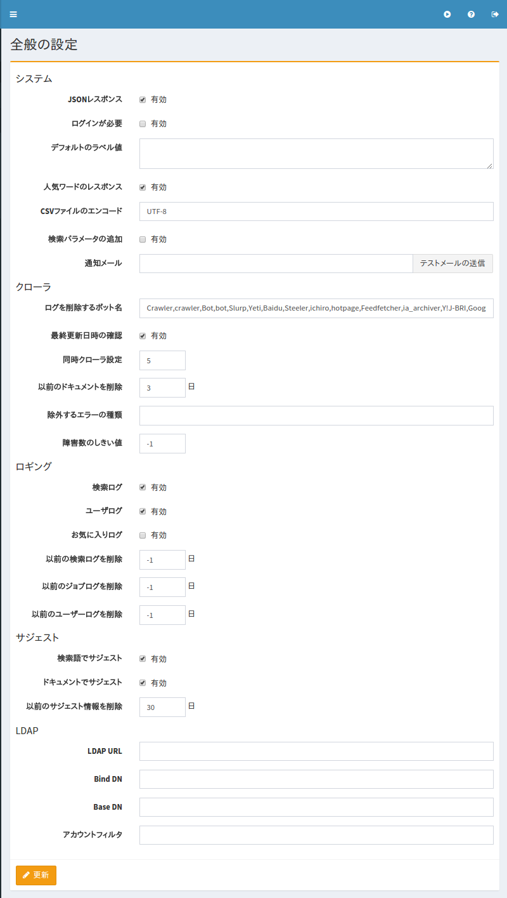

==========
全般の設定
==========

概要
====

この管理ページでは、 |Fess| の設定を管理することができます。
|Fess| を再起動せずに |Fess| の様々な設定を変更できます。

|image0|

設定内容
========

システム
--------

JSONレスポンス
::::::::::::::

JSON APIを有効にするかを指定します。

ログインが必要
::::::::::::::

検索機能をログインを必須にするかを指定します。

デフォルトのラベル値
::::::::::::::::::::

デフォルトで検索条件に追加するラベル値を記述します。

人気ワードのレスポンス
::::::::::::::::::::::

人気ワード APIを有効にするかを指定します。

CSVファイルのエンコード
:::::::::::::::::::::::

ダウンロードするCSVファイルのエンコーディングを指定します。

検索パラメータの追加
::::::::::::::::::::

検索結果表示にパラメータを渡す場合に有効にします。

通知メール
::::::::::

クロール完了時に通知するメールアドレスを指定します。

クローラ
--------

ログを削除するボット名
::::::::::::::::::::::

検索ログから除外するボット名を指定します。

最終更新日時の確認
::::::::::::::::::

差分クロールを行う場合に有効にします。

同時クローラ設定
::::::::::::::::

同時に実行するクロール設定数を指定します。

以前のドキュメントを削除
::::::::::::::::::::::::

インデックス後の有効期間の日数を指定します。

除外するエラーの種類
::::::::::::::::::::

障害URLの対象から除外する例外名を指定します。

障害数のしきい値
::::::::::::::::

クロール対象のドキュメントがここで指定された回数以上に障害URLに記録された場合は次回のクロールで対象外になります。

ロギング
--------

検索ログ
::::::::

検索ログの記録を有効にするかを指定します。

ユーザログ
::::::::::

ユーザーログの記録を有効にするかを指定します。

お気に入りログ
::::::::::::::

お気に入りログの記録を有効にするかを指定します。

以前の検索ログを削除
::::::::::::::::::::

指定された日数以前の検索ログを削除します。

以前のジョブログを削除
::::::::::::::::::::::

指定された日数以前のジョブログを削除します。

以前のユーザーログを削除
::::::::::::::::::::::::

指定された日数以前のユーザーログを削除します。

サジェスト
----------

検索語でサジェスト
::::::::::::::::::

検索ログからサジェスト候補を生成するかを指定します。

ドキュメントでサジェスト
::::::::::::::::::::::::

インデックスしたドキュメントからサジェスト候補を生成するかを指定します。

以前のサジェスト情報を削除
::::::::::::::::::::::::::

指定された日数以前のサジェストデータを削除します。

LDAP
----

LDAP URL
--------

LDAPサーバのを指定します。
例: ldap://localhost:389

Bind DN
-------

ユーザーの識別名を指定します。
例: uid=%s,ou=People,dc=fess,dc=codelibs,dc=org

Base DN
:::::::

検索画面にログインするベースの識別名を指定します。
例: dc=fess,dc=codelibs,dc=org

アカウントフィルタ
::::::::::::::::::

ユーザーのCommon Nameやuidなど指定します。
例: cn=%s や uid=%s

お知らせ表示
------------

ログインページ
::::::::::::::

ログイン画面に表示するメッセージを記述します。

検索トップページ
::::::::::::::::

検索トップ画面に表示するメッセージを記述します。

