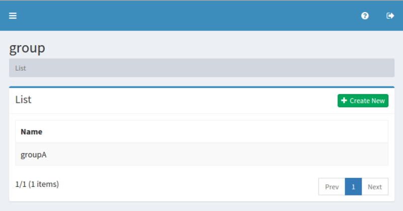

==============
グループの設定
==============

概要
====

TBD

管理方法
========

表示方法
--------

下図のグループの設定を行うための一覧ページを開くには、左メニューの [ユーザー > グループ] をクリックします。

|image0|

編集するには設定名をクリックします。

設定の作成
----------

グループの設定ページを開くには新規作成ボタンをクリックします。

|image1|

設定項目
--------

名前
::::

TBD

削除の方法
----------

リストページの設定名をクリックし、削除ボタンをクリックすると確認画面が表示されます。さらに削除ボタンを押すと設定が削除されます。

例
==

TBD
--------------------------

TBD

.. |image1| image:: ../../../resources/images/en/10.0/admin/group-2.png
