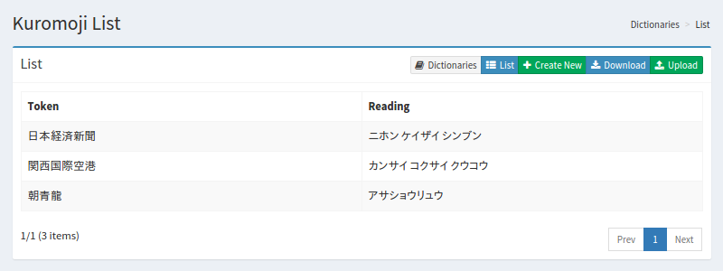

============
kuromoji一覧
============

概要
====

.. TODO import from fess9 docs
.. 設定項目
.. .txtのダウンロード、アップロード
人名、固有名詞、専門用語などを登録することができます。 ユーザー辞書のパスをクリックすると辞書に登録された単語一覧が表示されます。

管理方法
========

表示方法
--------

下図のkuromojiの設定リストページを開くには、左メニューの [システム > 辞書] を選択した後、kuromojiをクリックします。

|image0|

編集するには設定名をクリックします。

設定方法
--------------------

kuromojiの設定ページを開くには新規作成ボタンをクリックします。

|image1|

設定項目
--------

トークン
::::::::

検索対象とする単語を入力します。

分割
::::

単語が複合語の場合、分割した単語で検索されてもヒットするようにできます。 たとえば、「全文検索エンジン」を「全文 検索 エンジン」と入力することで、分割した単語でも検索できるようにします。

読み
::::

単語の読みをカタカナで入力します。分割を行った場合は分割して入力します。 たとえば、「ゼンブン ケンサク エンジン」と入力します。

品詞
::::

入力した単語の品詞を入力します。

.. |image1| image:: ../../../resources/images/en/10.0/admin/kuromoji-2.png
