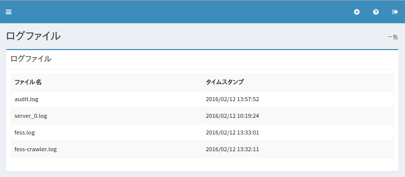

============
ログファイル
============

概要
====

.. TODO import from fess9 docs
.. 概要、ダウンロード
ここでは、 Fess で出力されるログファイルのダウンロードについて説明します。

設定方法
========

表示方法
--------

下図のログファイルページを開くには、左メニューの [システム情報 > ログファイル] をクリックします。

|image0|

ダウンロード
------------

表示されているログファイル名をクリックすると、ログファイルをダウンロードすることができます。

