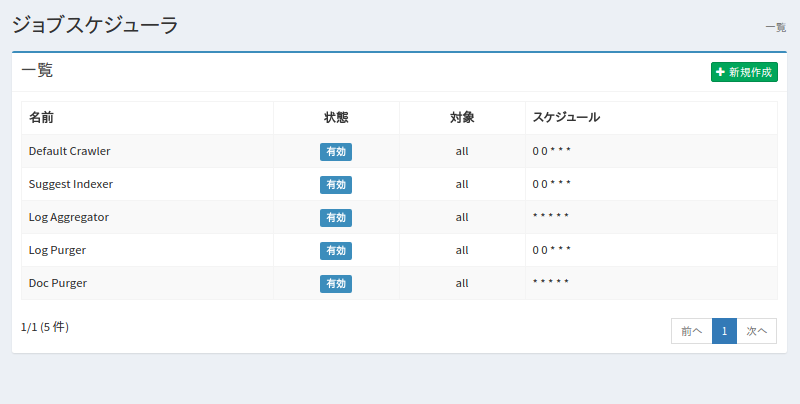
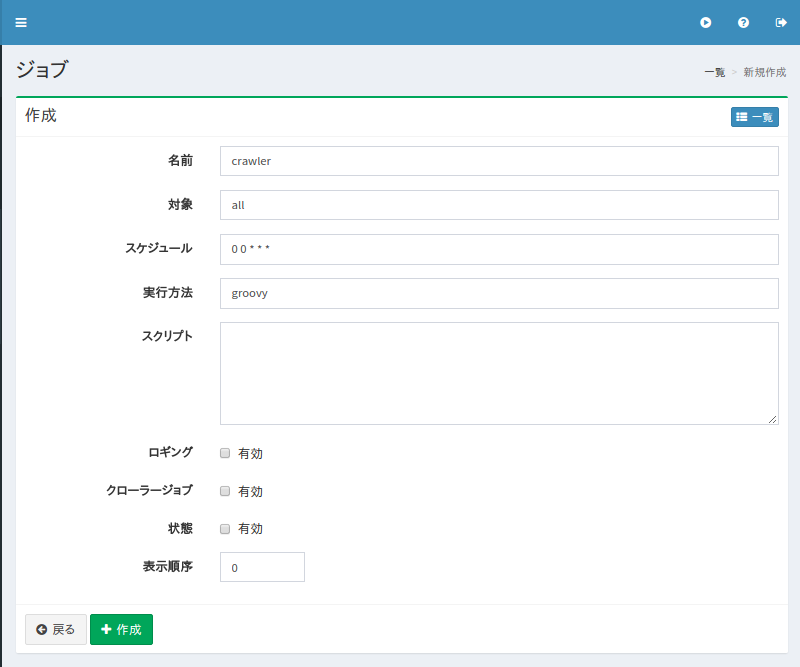

==================
スケジューラの設定
==================

概要
====

.. TODO import from fess9 docs
.. 概要、設定項目
ここでは、ジョブスケジューラに関する設定について説明します。

管理方法
========

表示方法
--------

下図のジョブスケジューラの設定一覧ページを開くには、左メニューの [システム > スケジューラ] をクリックします。

|image0|

編集するには設定名をクリックします。

設定の作成
----------

スケジューラの設定ページを開くには新規作成ボタンをクリックします。

|image1|

設定項目
--------

名前
::::

一覧で表示される名前です。

対象
::::

対象はジョブをバッチ等で直接コマンド実行するときに実行するかどうかの識別子として利用することができます。クロールをコマンド実行などしない場合は、「all」を指定してください。

スケジュール
::::::::::::

スケジュールの設定を行います。ここで設定したスケジュールでスクリプトで記述したジョブが実行されます。

記述形式はCronのような「秒 分 時 日 月 曜日
年(省略可)」の形式で記述します。たとえば、「0 0 12 ? \*
WED」の場合は、毎週水曜日の12:00pmにジョブを実行します。より細かい指定方法については「\ `Quartz <http://quartz-scheduler.org/documentation/quartz-2.2.x/tutorials/tutorial-lesson-06>`__\ 」を参照してください。

実行方法
::::::::

スクリプトの実行環境を指定します。現時点では「groovy」だけをサポートしています。

スクリプト
::::::::::

ジョブの実行内容を実行方法で指定した言語で記述します。

たとえば、3つのクロール設定のみをクロールジョブとして実行させたい場合は、以下のように記述します(前提としてウェブクロール設定のIDを1と2としファイルシステムクロール設定のIDを1とします)。

::

    return container.getComponent("crawlJob").execute(executor, ["1", "2"] as String[],["1"] as String[],[] as String[],"commit");

ロギング
::::::::

有効にすることでジョブログへ記録されます。

クローラージョブ
::::::::::::::::

有効にすることでクローラージョブとして扱われます。「システムの設定」でクロールの起動・停止対象となります。

状態
::::

ジョブの有効・無効の状態を指定します。無効にした場合はジョブは実行されません。

表示順序
::::::::

ジョブ一覧での表示順を指定します。

設定の削除
----------

一覧ページの設定名をクリックし、削除ボタンをクリックすると確認画面が表示されます。さらに削除ボタンを押すと設定が削除されます。

例
==

TBD
--------------------------

TBD

