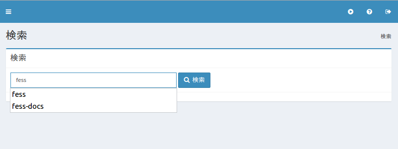

====
検索
====

概要
====

ここでは、管理用検索について説明します。

管理方法
========

表示方法
--------

下図の検索ページを開くには、左メニューの [システム情報 > 検索] をクリックします。

|image0|

検索一覧
--------

指定した条件で検索することができます。
通常の検索画面ではロールやブラウザの条件が暗黙的に付加されますが、この管理用検索では付加されません。
表示された検索結果から特定なドキュメントをインデックスから削除することもできます。

インデックスからすべてのドキュメントを削除したい場合は、「\*:\*」で「このクエリですべてを削除」ボタンをクリックすることで削除されます。

