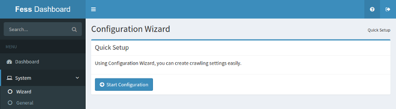
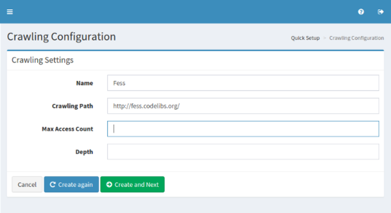
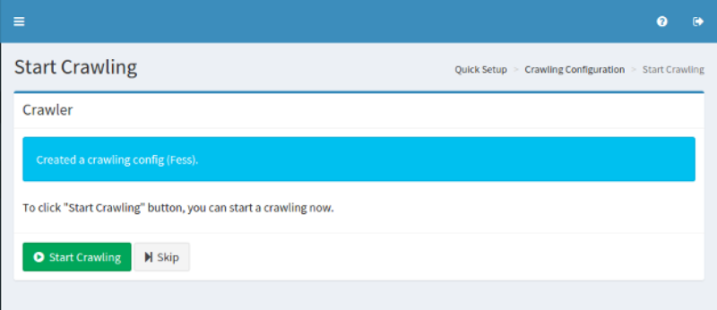

==============
構成ウィザード
==============

概要
====

ウィザードページはクロール設定を登録するための簡易セットアップツールを提供します。

簡易セットアップ
----------------

このページはクロール設定を登録するためのスタートアップページです。

|image0|

クロールの設定
--------------

このページでは、クロール設定を作成できます。

|image1|

* 名前: 設定名。 (例: Fess)
* クロールパス: クロール始点の URL あるいはファイルパス (例: http://fess.codelibs.org/)
* 最大アクセス数: クロールされるページの上限。
* 深さ: クロールしたドキュメント内に含まれるリンクをたどる際の深さ。

クローラ
--------

|Fess| クローラをスタートさせるにはクロールの開始ボタンをクリックします。まだクロールしない場合、スキップボタンをクリックします。

|image2|

