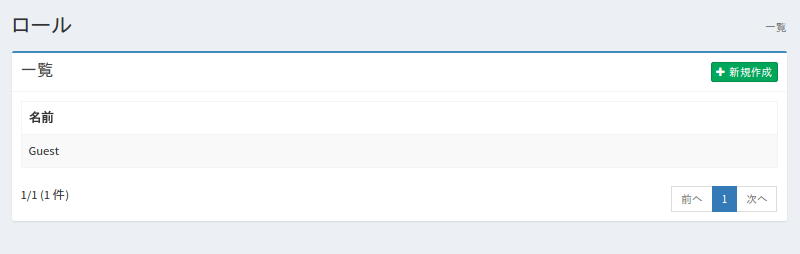
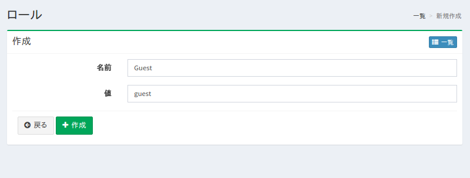

============
ロールの設定
============

概要
====

ここでは、検索用ロールに関する設定について説明します。
検索用ロールはクロール設定で選択することで、検索結果に表示されるドキュメントを分類することができます。

管理方法
========

表示方法
--------

下図のロールの設定一覧ページを開くには、左メニューの [クローラ > ロール] をクリックします。

|image0|

編集するには設定名をクリックします。

設定の作成
----------

ロールの設定ページを開くには作成ボタンをクリックします。

|image1|

設定項目
--------

名前
::::

一覧に表示される名前を指定します。

値
::

ドキュメントを分類するときの識別子を指定します。
英数字で指定してください。

設定の削除
----------

一覧ページの設定名をクリックし、削除ボタンをクリックすると確認画面が表示されます。
削除ボタンを押すと設定が削除されます。

