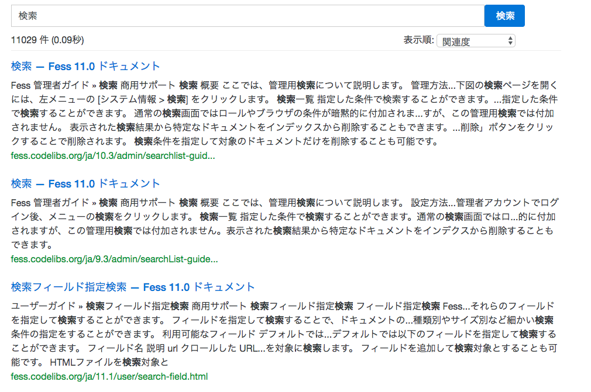

================================
サイト検索
================================

|Fess| は、検索APIを利用した検索ボックスをサイトに追加するスクリプトを提供しています。

設定
==================

以下のコードをHTML中の検索ボックスを表示したい位置に設置します。

::

    
    <fess:search></fess:search>

.. csv-table:: 表 利用可能なタグ
    :widths: 30, 60

    "<fess:search>", "検索フォームと検索結果を表示します。"
    "<fess:search-form-only>", "検索フォームを表示します。この検索フォームはsubmitすると、<script>中で``fess.setAttribute('fess-search-page-path', 'result.html');``で設定したページへ遷移します。"
    "<fess:search-result-only>", "検索結果を表示します。"

イメージ
==================

|image0|

