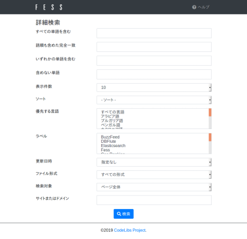

========
詳細検索
========

詳細検索
=========

詳細検索画面ではより複雑な検索ができます。

利用方法
--------

詳細検索画面は検索画面のオプションにある詳細検索ボタンからアクセスすることができます。

|image0|

ページ下部の検索ボタンを押すことで検索できます。

項目一覧
----------

すべての単語を含む
::::::::::::::::::

入力した単語すべてを含むドキュメントが検索できます。
単語はスペースで区切られます。

語順も含めた完全一致
::::::::::::::::::::

入力した文字列を含むドキュメントが検索できます。
スペースなどで区切ることはできません。

いずれかの単語を含む
::::::::::::::::::::

入力した単語のいずれかを含むドキュメントが検索できます。
単語はスペースで区切られます。

含めない単語
::::::::::::

入力した単語すべてを含まないドキュメントが検索できます。
単語はスペースで区切られます。

表示件数
::::::::

検索結果の１ページ内に含まれる検索結果の件数を指定できます。

ソート
::::::

検索日時などのフィールドを指定して検索結果をソートすることができます。

優先する言語
::::::::::::

検索結果で優先する言語を指定することができます。

ラベル
::::::

ラベル情報で絞り込み検索ができます。ラベルが登録されていない場合は表示されません。

更新日時
::::::::

ドキュメントの更新日時で絞り込み検索ができます。

ファイル形式
::::::::::::

ドキュメントのファイル形式で絞り込み検索ができます。

検索対象
::::::::

検索対象をページ全体、ページタイトル、ページURLの中から指定できます。

サイトまたはドメイン
::::::::::::::::::::

入力したサイトまたはドメインで絞り込み検索ができます。

