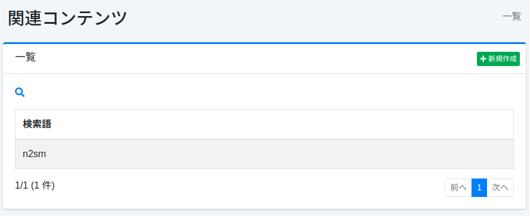
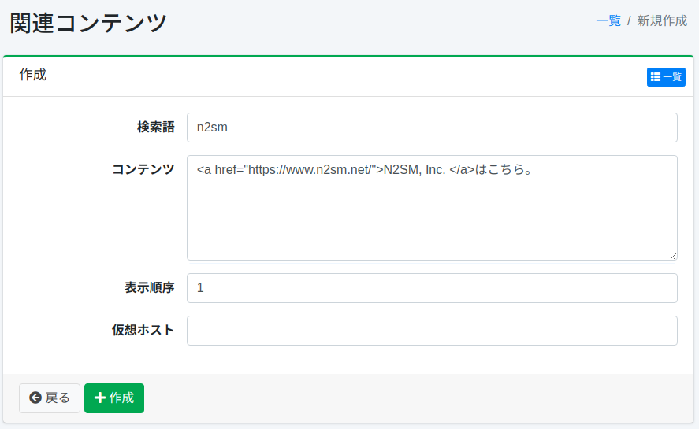

==============
関連コンテンツ
==============

概要
========

ここでは、関連コンテンツの設定について説明します。
検索クエリーが指定された検索語と一致する場合、関連コンテンツを検索結果の上部に表示させることができます。

管理方法
=====================

表示方法
----------------------

下図の関連コンテンツの設定を行うための一覧ページを開くには、左メニューの [クローラ > 関連コンテンツ] をクリックします。

|image0|

編集するには設定名をクリックします。

設定の作成
--------------------

関連コンテンツの設定ページを開くには新規作成ボタンをクリックします。

|image1|

設定項目
--------------

検索語
::::

検索クエリーと一致させたい検索語を指定します。

コンテンツ
:::::::

検索結果に表示させるコンテンツを指定します。

仮想ホスト
::::::::::::

仮想ホストのホスト名を指定します。
詳しくは :doc:`設定ガイドの仮想ホスト <../config/virtual-host>` を参照してください。

設定の削除
--------------------

一覧ページの設定名をクリックし、削除ボタンをクリックすると確認画面が表示されます。
削除ボタンを押すと設定が削除されます。

