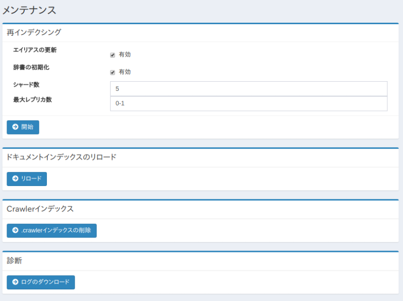

==============
メンテナンス
==============

概要
====

メンテナンスページはシステムのデータ操作を実行するときに利用します。

|image0|

操作方法
========

再インデクシング
----------------

既存のfessインデックスから新しいインデックスを再作成することができます。
インデックスのマッピングを変更したい場合などで実行します。

設定項目
--------

エイリアスの更新
::::

有効にすることで、再インデクシングが完了した後に既存のインデックスに割り当ててあるfess.searchとfess.updateのエイリアスを新しいインデックスに張り替えることができます。

辞書の初期化
::::

有効にすることで、辞書の設定を初期化することができます。

シャード数
::::

Elasticsearhのシャード数(index.number_of_shards)を指定することができます。

最大レプリカ数
::::

Elasticsearhの最大レプリカ数(index.auto_expand_replicas)を指定することができます。

ドキュメントインデックスのリロード
----------------

インデックスの設定を反映させるために、ドキュメントインデックスをリロードすることができます。

Crawlerインデックス
----------------

.crawlerインデックス(クロール情報)を削除することができます。
クローラの実行中には実行しないください。

診断
----------------

ログファイルをzip形式でダウンロードすることができます。

