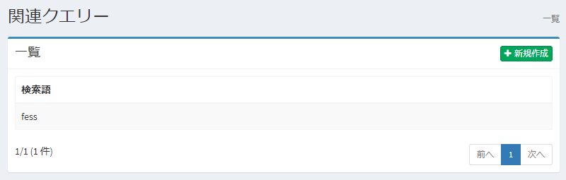
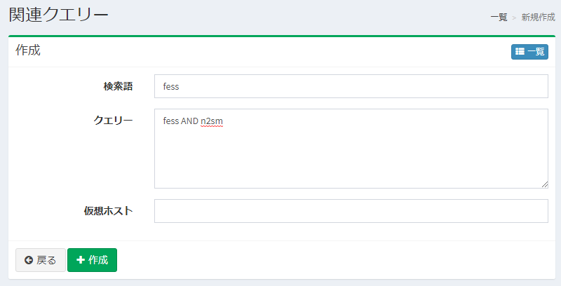

============
関連クエリー
============

概要
========

ここでは、関連クエリーの設定について説明します。
登録した関連クエリ―で検索結果を改善することができます。
関連クエリーは検索語の代替語として利用できます。

管理方法
=====================

表示方法
----------------------

下図の関連クエリ―の設定を行うための一覧ページを開くには、左メニューの [クローラ > 関連クエリー] をクリックします。

|image0|

編集するには設定名をクリックします。

設定の作成
--------------------

関連クエリーの設定ページを開くには新規作成ボタンをクリックします。

|image1|

設定項目
--------------

検索語
::::

検索クエリ―と一致させたい検索語を指定します。

クエリー
:::::::

クエリーを指定します。

仮想ホスト
::::::::::::

仮想ホストのホスト名を指定します。
詳しくは :doc:`設定ガイドの仮想ホスト <../config/virtual-host>` を参照してください。

設定の削除
--------------------

一覧ページの設定名をクリックし、削除ボタンをクリックすると確認画面が表示されます。
削除ボタンを押すと設定が削除されます。

