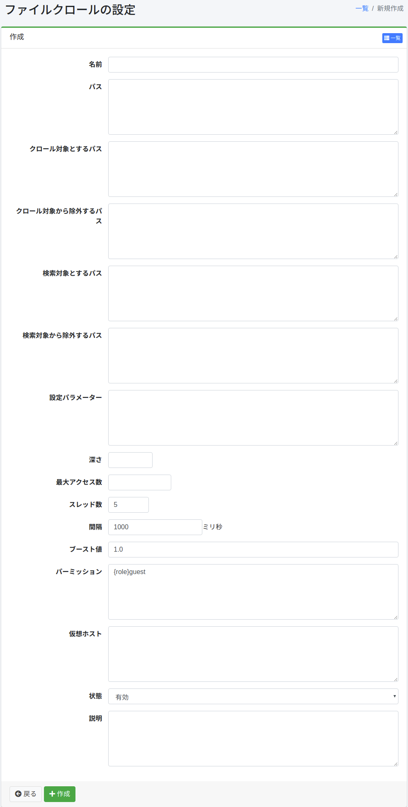

============
ファイルクロール
============

概要
====

ファイルクロールの設定ページでは、ファイルシステム上や共有されているネットワーク上のフォルダーのファイルをクロールする設定を管理することができます。

管理方法
======

表示方法
------

下図のファイルクロール設定を行うための一覧ページを開くには、左メニューの [クローラー > ファイルシステム] をクリックします。

|image0|

編集するには設定名をクリックします。

設定の作成
-------

ファイルクロールの設定ページを開くには新規作成ボタンをクリックします。

|image1|

設定項目
------

名前
::::

設定の名前です。

パス
::::

このパスでは、クロールを開始する場所を指定します(例: file:/ または smb://)。

クロール対象とするパス
:::::::::::::::::

この項目で指定した正規表現(Javaフォーマット)にマッチするパスは |Fess| クローラーの対象となります。

クロール対象から除外するパス
:::::::::::::::::::::

この項目で指定した正規表現(Javaフォーマット)にマッチするパスは |Fess| クローラーの対象となりません。

検索対象とするパス
::::::::::::::

この項目で指定した正規表現(Javaフォーマット)にマッチするパスは検索の対象となります。

検索対象から除外するパス
::::::::::::::::::

この項目で指定した正規表現(Javaフォーマット)にマッチするパスは検索の対象となりません。

設定パラメーター
::::::::::::

クロール設定情報を指定することができます。

深さ
::::

クロールするファイルシステム構造の深さを指定します。

最大アクセス数
:::::::::::

インデックスするパスの数を指定します。

スレッド数
::::::::

この設定のために使用するスレッドの数を指定します。

間隔
::::

スレッドがパスをクロールするごとに待機する時間を指定します。

ブースト値
::::::::

ブースト値とは、この設定によってインデックスされたドキュメントの優先度です。

パーミッション
:::::::::::

この設定のパーミッションを指定します。
パーミッションの指定方法は、たとえば、developerグループに属するユーザーに検索結果を表示させるためには{group}developerと指定します。
ユーザー単位の指定は{user}ユーザー名、ロール単位の指定は{role}ロール名、グループ単位の指定は{group}グループ名で指定します。

仮想ホスト
::::::::

仮想ホストのホスト名を指定します。
詳しくは :doc:`設定ガイドの仮想ホスト <../config/virtual-host>` を参照してください。

状態
::::

この設定が有効であるとき、デフォルトクローラーのジョブはこの設定を含んでクロールを行います。

説明
::::

説明を入力できます。

設定の削除
--------

一覧ページの設定名をクリックし、削除ボタンをクリックすると確認画面が表示されます。削除ボタンを押すと設定が削除されます。

例
==

ローカルファイルをクロール
--------------------

/home/share 下のファイルをクロールするならば、設定は以下のようになります。

.. tabularcolumns:: |p{4cm}|p{8cm}|
.. list-table::
   :header-rows: 1

   * - 名前
     - 値
   * - 名前
     - Share ディレクトリ
   * - パス
     - file:/home/share

他のパラメーターはデフォルトの設定で構いません。

Windowsの共有フォルダーをクロール
---------------------------

\\SERVER\SharedFolder 下のファイルをクロールするならば、設定は以下のようになります。

.. tabularcolumns:: |p{4cm}|p{8cm}|
.. list-table::
   :header-rows: 1

   * - 名前
     - 値
   * - 名前
     - 共有フォルダー
   * - パス
     - smb://SERVER/SharedFolder/

共有フォルダーのアクセスに ユーザー名/パスワード が必要ならば、左メニューの [クローラー > ファイル認証] からファイル認証の設定を作成する必要があります。
その際の設定は以下のようになります。

.. tabularcolumns:: |p{4cm}|p{8cm}|
.. list-table::
   :header-rows: 1

   * - 名前
     - 値
   * - ホスト名
     - SERVER
   * - スキーム
     - SAMBA
   * - ユーザー名
     - (入力してください)
   * - パスワード
     - (入力してください)

.. |image0| image:: ../../../resources/images/ja/14.11/admin/fileconfig-1.png

.. pdf            :height: 940 px
