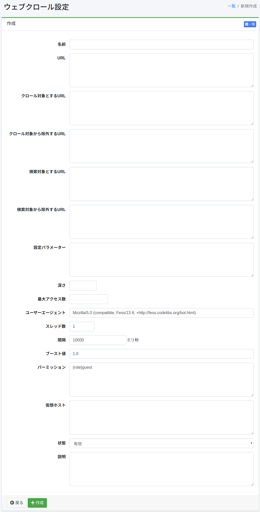

===========
ウェブクロール
===========

概要
====

ウェブクロール設定ページではウェブクロールの設定を行います。

管理方法
======

表示方法
------

下図のウェブクロールの設定一覧ページを開くには、左メニューの[クローラー > ウェブ] をクリックします。

|image0|

編集するには設定名をクリックします。

設定の作成
--------

ウェブクロールの設定ページを開くには作成ボタンをクリックします。

|image1|

設定項目
------

名前
::::

設定名。

URL
::::

クロールの始点となるURL。

クロール対象とするURL
:::::::::::::::::

この項目で指定した正規表現(Javaフォーマット)にマッチするURLは |Fess| クローラーの対象となります。

クロール対象から除外するURL
:::::::::::::::::::::

この項目で指定した正規表現(Javaフォーマット)にマッチするURLは |Fess| クローラーの対象となりません。

検索対象とするURL
::::::::::::::

この項目で指定した正規表現(Javaフォーマット)にマッチするURLは検索の対象となります。

検索対象から除外するURL
::::::::::::::::::

この項目で指定した正規表現(Javaフォーマット)にマッチするURLは検索の対象となりません。

設定パラメーター
::::::::::::

クロール設定情報を指定することができます。

深さ
::::

クロールしたドキュメント内に含まれるリンクをたどる際の深さを指定できます。

最大アクセス数
:::::::::::

インデックスされるurlの数。

ユーザーエージェント
:::::::::::::::

|Fess| クローラーの名前。

スレッド数
::::::::

この設定におけるクロールするスレッド数。

間隔
::::

URLをクロールする際のそれぞれのスレッドにおける時間間隔。

ブースト値
::::::::

この設定におけるインデックスされたドキュメントの重み。

パーミッション
:::::::::::

この設定のパーミッションを指定します。
パーミッションの指定方法は、たとえば、developerグループに属するユーザーに検索結果を表示させるためには{group}developerと指定します。
ユーザー単位の指定は{user}ユーザー名、ロール単位の指定は{role}ロール名、グループ単位の指定は{group}グループ名で指定します。

仮想ホスト
::::::::

仮想ホストのホスト名を指定します。
詳しくは :doc:`../config/virtual-host` を参照してください。

状態
::::

もし有効であるなら、デフォルトクローラーのスケジュールジョブはこの設定を含みます。

説明
::::

説明を入力できます。

設定の削除
--------

一覧ページの設定名をクリックし、削除ボタンをクリックすると確認画面が表示されます。削除ボタンを押すと設定が削除されます。

例
==

fess.codelibs.org をクロールする
-----------------------------

https://fess.codelibs.org/ 以下のページをクロールするウェブクロール設定を作る場合、下のような設定値にします。

.. tabularcolumns:: |p{4cm}|p{8cm}|
.. list-table::
   :header-rows: 1

   * - 設定項目
     - 設定値
   * - 名前
     - Fess
   * - URL
     - https://fess.codelibs.org/
   * - クロール対象とするURL
     - https://fess.codelibs.org/.*

他の設定値はデフォルト値を使用します。

ウェブ認証サイトのウェブクロール
------------------------

Fess は BASIC 認証と DIGEST 認証と NTLM 認証に対するクロールに対応しています。
ウェブ認証についての詳細はウェブ認証ページを参考にしてください。

Redmine
:::::::

パスワードで保護されているRedmine(例. https://<server>/)のページをクロールするウェブクロール設定を作る場合、下のような設定値にします。

.. tabularcolumns:: |p{4cm}|p{8cm}|
.. list-table::
   :header-rows: 1

   * - 設定項目
     - 設定値
   * - 名前
     - Redmine
   * - URL
     - https://<server>/my/page
   * - クロール対象とするURL
     - https://<server>/.*
   * - 設定パラメーター
     - client.robotsTxtEnabled=false (Optional)

そのあと、下記のような設定値でウェブ認証の設定の作成を行います。

.. tabularcolumns:: |p{4cm}|p{8cm}|
.. list-table::
   :header-rows: 1

   * - 設定項目
     - 設定値
   * - スキーム
     - Form
   * - ユーザー名
     - (Account for crawling)
   * - パスワード
     - (Password for the account)
   * - パラメーター
     - | encoding=UTF-8
       | token_method=GET
       | token_url=https://<server>/login
       | token_pattern=name="authenticity_token"[^>]+value="([^"]+)"
       | token_name=authenticity_token
       | login_method=POST
       | login_url=https://<server>/login
       | login_parameters=username=${username}&password=${password}
   * - ウェブ認証
     - Redmine

XWiki
:::::

XWiki(例. https://<server>/xwiki/)のページをクロールするウェブクロール設定を作る場合、下のような設定値にします。

.. tabularcolumns:: |p{4cm}|p{8cm}|
.. list-table::
   :header-rows: 1

   * - 設定項目
     - 設定値
   * - 名前
     - XWiki
   * - URL
     - https://<server>/xwiki/bin/view/Main/
   * - クロール対象とするURL
     - https://<server>/.*
   * - 設定パラメーター
     - client.robotsTxtEnabled=false (Optional)

そのあと、下記のような設定値でウェブ認証の設定の作成を行います。

.. tabularcolumns:: |p{4cm}|p{8cm}|
.. list-table::
   :header-rows: 1

   * - 設定項目
     - 設定値
   * - スキーム
     - Form
   * - ユーザー名
     - (Account for crawling)
   * - パスワード
     - (Password for the account)
   * - パラメーター
     - | encoding=UTF-8
       | token_method=GET
       | token_url=http://<server>/xwiki/bin/login/XWiki/XWikiLogin
       | token_pattern=name="form_token" +value="([^"]+)"
       | token_name=form_token
       | login_method=POST
       | login_url=http://<server>/xwiki/bin/loginsubmit/XWiki/XWikiLogin
       | login_parameters=j_username=${username}&j_password=${password}
   * - ウェブ認証
     - XWiki

.. |image0| image:: ../../../resources/images/ja/14.14/admin/webconfig-1.png

.. pdf            :height: 940 px
