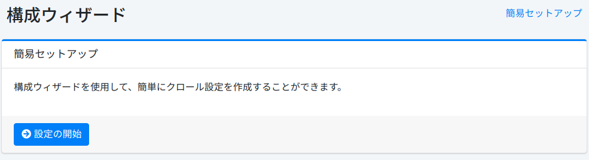

===========
構成ウィザード
===========

概要
====

ウィザードページはクロール設定を登録するための簡易セットアップツールを提供します。

簡易セットアップ
------------

このページはクロール設定を登録するためのスタートアップページです。

|image0|

クロールの設定
-----------

このページではクロール設定を作成できます。

|image1|

設定項目
------

名前
::::

設定名 (例: Fessサイト)を指定します。

クロールパス
:::::::::

クロール始点の URL あるいはファイルパス (例: https://fess.codelibs.org/)を指定します。

最大アクセス数
:::::::::::

クロールされるページの上限を設定します。

深さ
::::

クロールしたドキュメント内に含まれるリンクをたどる際の深さを設定します。

クローラ
------

|Fess| クローラーをスタートさせるにはクロールの開始ボタンをクリックします。まだクロールしない場合、スキップボタンをクリックします。

|image2|

.. |image2| image:: ../../../resources/images/ja/14.15/admin/wizard-3.png
