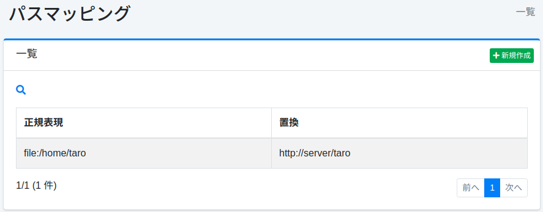

===========
パスマッピング
===========

概要
====

ここでは、パスマッピングに関する設定について説明します。
パスマッピングは検索結果に表示するリンクを置き換えたい場合などに利用することができます。

管理方法
======

表示方法
------

下図のパスマッピングの設定一覧ページを開くには、左メニューの [クローラー > パスマッピング] をクリックします。

|image0|

編集するには設定名をクリックします。

設定の作成
--------

パスマッピングの設定ページを開くには新規作成ボタンをクリックします。

|image1|

設定項目
------

正規表現
::::::

置換したい文字列を指定します。
記述方法は Java の正規表現に従います。

置換
::::

一致した正規表現を置き換える文字列を指定します。

処理の種類
::::::::

置換するタイミングを指定します。

* クロール：クロール時にドキュメント取得後、インデクシングする前にURLを置換する。
* 表示：検索時に表示する前にURLを置換する。
* クロール/表示：クロールと表示の両方でURLを置換する。
* 保存したURL：クロール時にドキュメント取得前にURLを置換する。

表示順序
::::::

パスマッピングの処理順を指定できます。
昇順に処理されます。

設定の削除
--------

一覧ページの設定名をクリックし、削除ボタンをクリックすると確認画面が表示されます。
削除ボタンを押すと設定が削除されます。

.. |image1| image:: ../../../resources/images/ja/14.16/admin/pathmap-2.png
