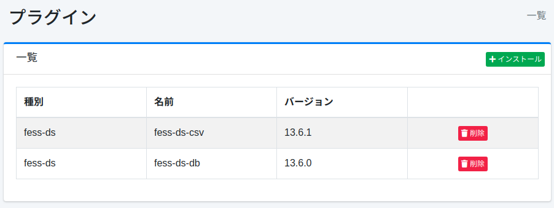

========
プラグイン
========

概要
====

プラグイン設定ページではプラグインを管理します。

管理方法
======

表示方法
------

下図のページのインストール済みプラグインの一覧ページを開くには、左メニューの [システム > プラグイン] をクリックします。

|image0|

アンインストールする場合は削除ボタンをクリックします。

インストール
---------

新規にプラグインをインストールするにはインストールボタンをクリックします。

|image1|

プルダウンメニューでインストールしたいプラグインを選択してインストールボタンをクリックすると、インストールが開始されます。

