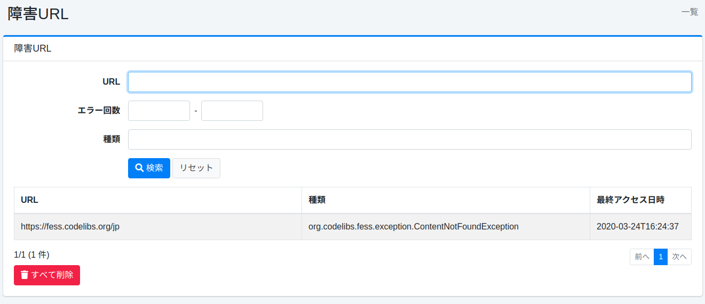

======
障害URL
======

概要
====

ここでは、障害 URL について説明します。
クロール時に取得できなかった URL が記録され、障害 URL として確認することができます。

管理方法
======

表示方法
------

障害 URL を確認するための一覧ページを開くには、左メニューの [システム情報 > 障害URL] をクリックします。

|image0|

障害 URL の確認リンクをクリックすると、詳細が表示されます。

障害URLの詳細
===========

障害URLの詳細ではクロール時に発生した例外が記録されます。

|image1|

詳細の内容
--------

URL
::::

例外が発生したURL。

スレッド名
::::::::

クロールを実行していたスレッド名。
ログファイルを確認するときに利用できます。

種類
::::

例外の種類。

ログ
::::

例外の内容。

エラー回数
::::::::

この例外が発生した回数。

最終アクセス日時
::::::::::::

この例外が発生した時刻。

.. |image1| image:: ../../../resources/images/ja/14.19/admin/failureurl-2.png
