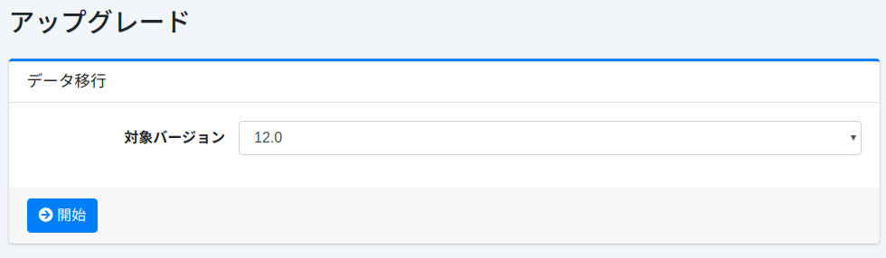

===========
アップグレード
===========

概要
====

アップグレードページは過去のリリースからのデータ移行を実行するときに利用します。

|image0|

操作方法
======

バックアップ
---------
アップグレードの前に以下のバックアップファイルをダウンロードします。

- .fess_basic_config.bulk
- .fess_user.bulk
- system.properties

以下のファイルも取得します。

- app/WEB-INF/classes/fess_config.properties

データ移行
--------

管理者としてログインした状態で、URLに手動で /admin/upgrade/ を入力してページを表示します。
移行元の |Fess| のバージョンを選択して、データ移行ボタンを押下してデータを移行します。

設定項目
------

対象バージョン
::::

移行元のバージョンを選択します。

