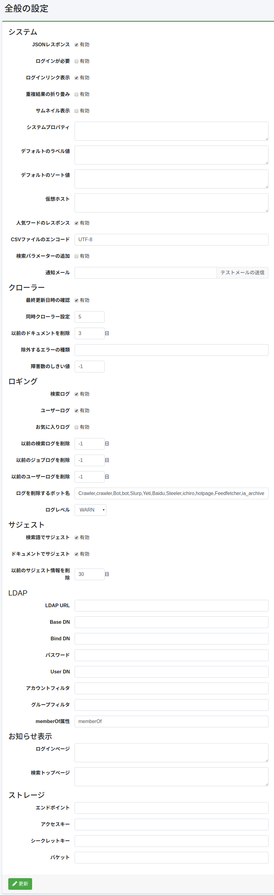

====
全般
====

概要
====

この管理ページでは、 |Fess| の設定を管理することができます。
|Fess| を再起動せずに |Fess| の様々な設定を変更できます。

|image0|

設定内容
========

システム
--------

JSONレスポンス
::::::::::::::

JSON APIを有効にするかを指定します。

ログインが必要
::::::::::::::

検索機能をログインを必須にするかを指定します。

ログインリンク表示
::::::::::::::::::

検索画面でログインページヘのリンクを表示するかどうかを設定します。

重複結果の折り畳み
::::::::::::::::::::

重複結果を折り畳みを有効にするかを設定します。

サムネイル表示
::::::::::::::::::::

サムネイル表示を有効にするかを設定します。

デフォルトのラベル値
::::::::::::::::::::

デフォルトで検索条件に追加するラベル値を記述します。
ロールやグループ単位で指定する場合は、「role:admin=label1」のように role: または group: を付加して指定します。

デフォルトのソート値
::::::::::::::::::::

デフォルトで検索条件に追加するソート値を記述します。
ロールやグループ単位で指定する場合は、「role:admin=content_length.desc」のように role: または group: を付加して指定します。

仮想ホスト
::::::::::::::::::::

仮想ホストを設定します。
詳しくは :doc:`設定ガイドの仮想ホスト <../config/virtual-host>` を参照してください。

人気ワードのレスポンス
::::::::::::::::::::::

人気ワード APIを有効にするかを指定します。

CSVファイルのエンコード
:::::::::::::::::::::::

ダウンロードするCSVファイルのエンコーディングを指定します。

検索パラメータの追加
::::::::::::::::::::

検索結果表示にパラメータを渡す場合に有効にします。

通知メール
::::::::::

クロール完了時に通知するメールアドレスを指定します。
カンマ区切りで複数指定が可能です。使用するためにはメールサーバが必要です。

クローラ
--------

最終更新日時の確認
::::::::::::::::::

差分クロールを行う場合に有効にします。

同時クローラ設定
::::::::::::::::

同時に実行するクロール設定数を指定します。

以前のドキュメントを削除
::::::::::::::::::::::::

インデックス後の有効期間の日数を指定します。

除外するエラーの種類
::::::::::::::::::::

しきい値を超える障害URLはクロール対象から除外されますが、ここで指定された例外名などはしきい値を超える障害URLでもクロール対象になります。

障害数のしきい値
::::::::::::::::

クロール対象のドキュメントがここで指定された回数以上に障害URLに記録された場合は次回のクロールで対象外になります。

ロギング
--------

検索ログ
::::::::

検索ログの記録を有効にするかを指定します。

ユーザログ
::::::::::

ユーザーログの記録を有効にするかを指定します。

お気に入りログ
::::::::::::::

お気に入りログの記録を有効にするかを指定します。

以前の検索ログを削除
::::::::::::::::::::

指定された日数以前の検索ログを削除します。

以前のジョブログを削除
::::::::::::::::::::::

指定された日数以前のジョブログを削除します。

以前のユーザーログを削除
::::::::::::::::::::::::

指定された日数以前のユーザーログを削除します。

ログを削除するボット名
::::::::::::::::::::::

検索ログから除外するボット名を指定します。

ログレベル
::::::::::

fess.logのログレベルを指定します。

サジェスト
----------

検索語でサジェスト
::::::::::::::::::

検索ログからサジェスト候補を生成するかを指定します。

ドキュメントでサジェスト
::::::::::::::::::::::::

インデックスしたドキュメントからサジェスト候補を生成するかを指定します。

以前のサジェスト情報を削除
::::::::::::::::::::::::::

指定された日数以前のサジェストデータを削除します。

LDAP
----

LDAP URL
::::::::

LDAPサーバのを指定します。

Base DN
:::::::

検索画面にログインするベースの識別名を指定します。

Bind DN
:::::::

管理者のBind DNを指定します。

パスワード
:::::::

Bind DNのパスワードを指定します。

User DN
:::::::

ユーザーの識別名を指定します。

アカウントフィルタ
::::::::::::::::::

ユーザーのCommon Nameやuidなど指定します。

グループフィルタ
::::::::::::::::::

取得したいグループのフィルタ条件を指定します。

memberOf属性
::::::::::::::

LDAPサーバで利用できるmemberOf属性名を指定します。
Active Directoryの場合、memberOfです。
その他のLDAPサーバではisMemberOfの場合もあります。

お知らせ表示
------------

ログインページ
::::::::::::::

ログイン画面に表示するメッセージを記述します。

検索トップページ
::::::::::::::::

検索トップ画面に表示するメッセージを記述します。

例
==

LDAPの設定例
------------

.. tabularcolumns:: |p{4cm}|p{4cm}|p{4cm}|
.. list-table:: LDAP/Active Directory の設定
   :header-rows: 1

   * - 名前
     - 値 (LDAP)
     - 値 (Active Directory)
   * - LDAP URL
     - ldap://SERVERNAME:389
     - ldap://SERVERNAME:389
   * - Base DN
     - cn=Directory Manager
     - dc=fess,dc=codelibs,dc=org
   * - Bind DN
     - uid=%s,ou=People,dc=fess,dc=codelibs,dc=org
     - manager@fess.codelibs.org
   * - User DN
     - uid=%s,ou=People,dc=fess,dc=codelibs,dc=org
     - %s@fess.codelibs.org
   * - アカウントフィルタ
     - cn=%s または uid=%s
     - (&(objectClass=user)(sAMAccountName=%s))
   * - グループフィルタ
     -
     - (member:1.2.840.113556.1.4.1941:=%s)
   * - memberOf
     - isMemberOf
     - memberOf

.. pdf            :height: 940 px
