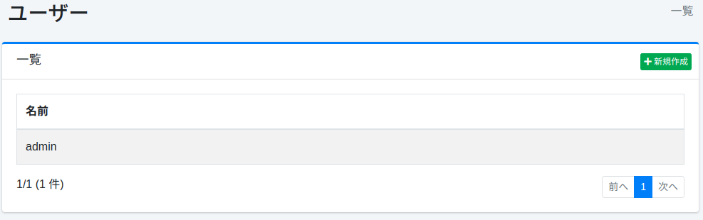
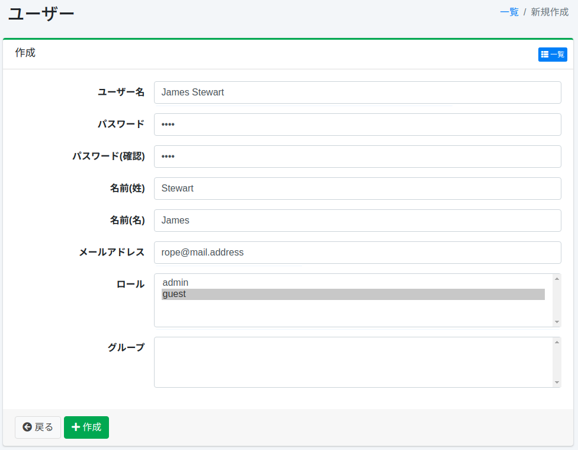

========
ユーザー
========

概要
====

|Fess| にログインするユーザーを管理することができます。

管理方法
========

表示方法
--------

下図のユーザーの設定一覧ページを開くには、左メニューの [ユーザー > ユーザー] をクリックします。

|image0|

編集するには設定名をクリックします。

設定の作成
----------

ユーザーの設定ページを開くには新規作成ボタンをクリックします。

|image1|

設定項目
--------

ユーザー名
::::::::::

ユーザー名。

ロール
::::::

ユーザーが属するロールを指定します。

グループ
::::::::

ユーザーが属するグループを指定します。

設定の削除
----------

一覧ページの設定名をクリックし、削除ボタンをクリックすると確認画面が表示されます。
削除ボタンを押すと設定が削除されます。

