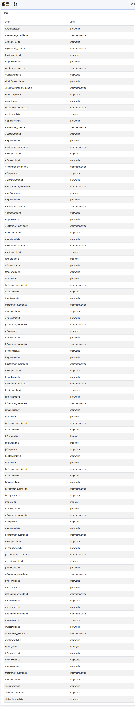

====
辞書
====

概要
====

ここでは、辞書に関する設定について説明します。

辞書の変更は各辞書に関する仕様を理解した上で実施してください。
辞書の変更に失敗するとインデックスにアクセスできなくなる場合があります。

一覧
====

下図の管理可能な辞書一覧ページを開くには、左メニューの [システム > 辞書] をクリックします。

|image0|

Kuromoji
========

日本語形態素解析用の辞書を管理します。
ja/kuromoji.txt は日本語の形態素解析用辞書になります。

同義語
======

同義語辞書の管理をします。
synonym.txtは言語共通で利用される同義語辞書ファイルになります。

マッピング
==========

文字置換辞書の管理をします。
mapping.txtは言語共通または各言語用の単語置換辞書ファイルになります。

Protwords
=========

保護単語辞書の管理をします。
protwords.txtは各言語用に配置して、ステミングの対象外などにするための単語一覧ファイルになります。

ストップワード
=========

ストップワード辞書の管理をします。
stopwords.txtは各言語用に配置して、特定の文字を別の文字にストップワードするための単語一覧ファイルになります。

Stemmer上書き
=========

Stemmer上書き辞書の管理をします。
stemmer_override.txtは各言語用に配置して、特定の文字を別の文字にStemmer上書きするための単語置換辞書ファイルになります。

