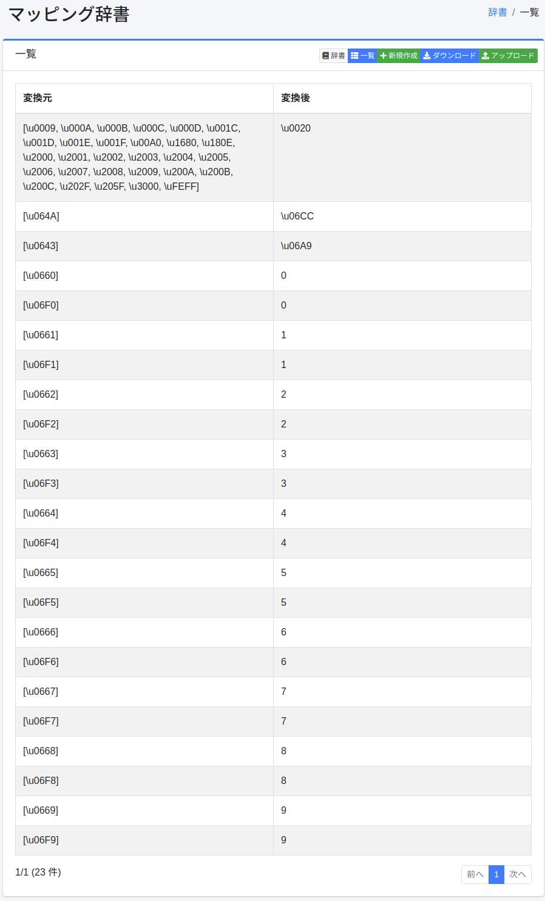

==============
マッピング辞書
==============

概要
====

特定の文字(記号・文字コード・全角半角)を別の文字にマッピングさせることができます。

管理方法
========

表示方法
--------

下図のマッピングの設定一覧ページを開くには、左メニューの [システム > 辞書] を選択した後、mappingをクリックします。

|image0|

編集するには設定名をクリックします。

設定方法
--------

マッピングの設定ページを開くには新規作成ボタンをクリックします。

|image1|

設定項目
--------

変換元
::::::

マッピングの対象とする文字(記号・文字コード・全角半角)を入力します。

変換後
::::::

変換元で入力した文字を変換後の文字で展開します。

ダウンロード
============

マッピングの辞書形式でダウンロードすることができます。

アップロード
============

マッピングの辞書形式でアップロードすることができます。

.. |image1| image:: ../../../resources/images/ja/14.4/admin/mapping-2.png

