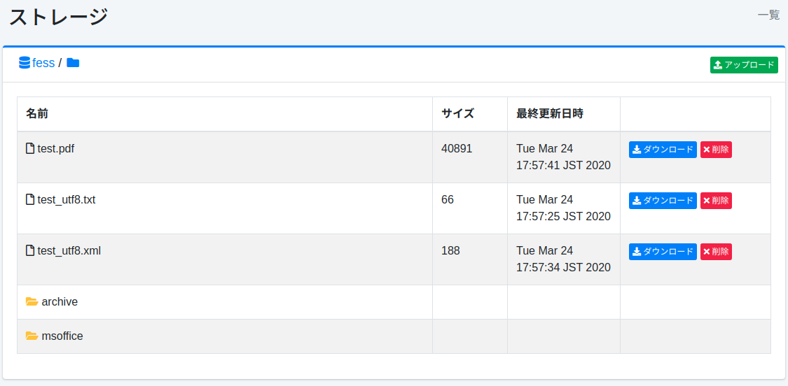

================
ストレージ
================

概要
====

ストレージページでは、Amazon S3互換のオブジェクトストレージであるMinIO上のファイル管理ができます。

管理方法
========

オブジェクトストレージサーバーの設定
------------------------------------

 [システム > 全般]からストレージの設定を開き、以下の項目を設定します。

- エンドポイント: ストレージサーバーのエンドポイントURL
- アクセスキー: ストレージサーバーのアクセスキー
- シークレットキー: ストレージサーバーのシークレットキー
- バケット: 管理するバケット名

表示方法
--------

下図のオブジェクト一覧ページを開くには、左メニューの [システム > ストレージ] をクリックします。

|image0|

名前
::::

オブジェクトのファイル名

サイズ
::::::

オブジェクトのサイズ

最終更新日時
::::::::::::

オブジェクトの最終更新日時

ダウンロード
------------

ダウンロードボタンをクリックすることで、オブジェクトをダウンロードすることができます。

削除
----

削除ボタンをクリックすることで、オブジェクトを削除することができます。

アップロード
------------

右上のファイルアップロードボタンをクリックして、ファイルのアップロードウィンドウを開くことができます。

フォルダの作成
--------------

パス表示の右にあるフォルダ作成ボタンをクリックすることで、フォルダ作成ウィドウを開くことができます。空のフォルダは作成できないことに注意してください。

