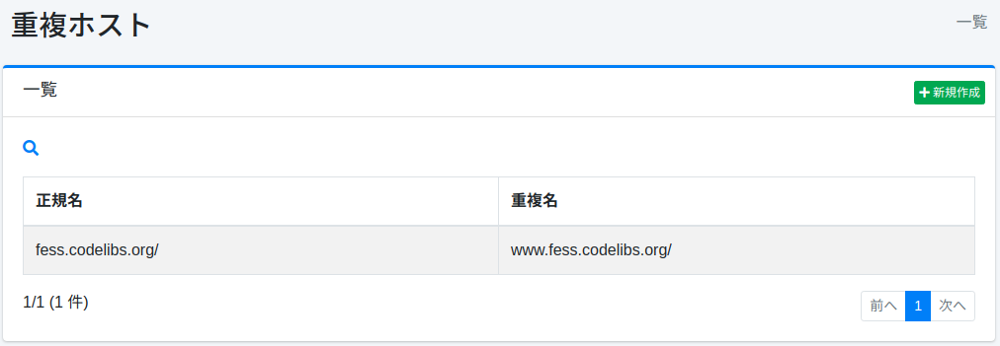

==========
重複ホスト
==========

概要
====

ここでは、重複ホストに関する設定について説明します。
重複ホストはクロール時に異なるホスト名を同一のものとして扱いたいときに利用します。
たとえば、www.example.com と example.com を同じサイトとして扱いたい場合などで利用できます。

管理方法
========

表示方法
--------

下図の重複ホストの設定を行うための一覧ページを開くには、左メニューの [クローラ > 重複ホスト] をクリックします。

|image0|

編集するには設定名をクリックします。

設定の作成
----------

重複ホストの設定ページを開くには新規作成ボタンをクリックします。

|image1|

設定項目
--------

正規名
::::::

正規ホスト名を指定します。重複ホスト名は正規ホスト名に置き換えます。

重複名
::::::

重複しているホスト名を指定します。置き換えたいホスト名を指定します。

設定の削除
----------

一覧ページの設定名をクリックし、削除ボタンをクリックすると確認画面が表示されます。
削除ボタンを押すと設定が削除されます。

.. |image1| image:: ../../../resources/images/ja/14.6/admin/duplicatehost-2.png
